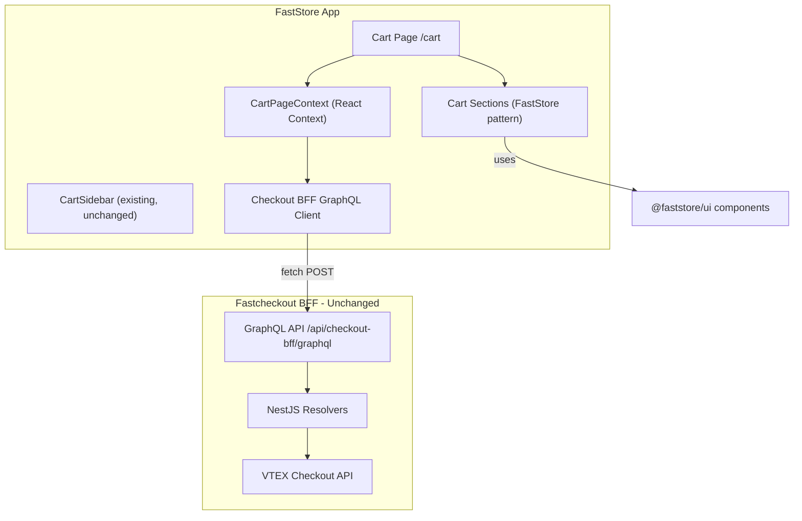

# Fastcheckout Cart Migration to FastStore

## Context

The fastcheckout cart (`fastcheckout/packages/apps/client/src/screens/Cart/`) is a full-page cart experience built with React Relay, custom UI components (`fast-checkout/ui`), and a NestJS GraphQL BFF. It needs to become a page within the FastStore app (`faststore/packages/core/`), using FastStore's section/CMS architecture, SCSS modules, and `@faststore/ui` components.

The fastcheckout BFF stays as-is. The existing CartSidebar in FastStore also stays (quick view), alongside the new full cart page.

## Architecture




## Key Decisions

- **Data fetching**: Simple fetch-based GraphQL client (no Relay). Plain GraphQL queries/mutations sent to the fastcheckout BFF endpoint.
- **State management**: A `CartPageContext` (React Context + useReducer) holds cart state, with mutations updating the context from BFF responses.
- **Styling**: SCSS modules (`.module.scss`) following FastStore patterns, importing `@faststore/ui` component styles.
- **CartSidebar**: Remains as-is for quick cart access from Navbar. The cart page is a separate full experience.

## File Structure (New Files)

All new files under `faststore/packages/core/src/`:

```
src/
  pages/cart.tsx                          # Next.js page
  components/cart-page/
    CartPage.tsx                          # Main cart page section
    CartPage.module.scss                  # Page layout styles
    context/
      CartPageContext.tsx                  # React context + provider
      types.ts                            # TypeScript types for BFF data
    graphql/
      client.ts                           # Fetch-based GraphQL client for BFF
      queries.ts                          # CartQuery, SummaryQuery
      mutations.ts                        # All cart mutations (plain strings)
    sections/
      CartList/
        CartList.tsx                       # Cart items list section
        CartList.module.scss
        CartListHeader.tsx                 # Items count + Remove All
        CartListGroupedByDeliveryType.tsx  # Grouped list
        CartListMultidelivery.tsx          # Multi-address list
      CartItem/
        CartPageItem.tsx                   # Cart item (wraps @faststore/ui CartItem)
        CartPageItem.module.scss
        CartItemUnavailable.tsx
      Shipping/
        ShippingChannelSelector.tsx        # Delivery vs Pickup
        Shipping.module.scss
        Delivery.tsx
        Pickup.tsx
        ShippingAddressDrawer.tsx
        SelectedDeliveryInformation.tsx
      Summary/
        CartPageSummary.tsx               # Order summary section
        CartPageSummary.module.scss
      Coupon/
        Coupon.tsx                         # Promo code section
        Coupon.module.scss
      OneClickCheckout/
        OneClickCheckoutOptions.tsx        # Apple Pay / Google Pay
      ActionButton/
        CartActionButton.tsx              # Proceed to checkout
        CartActionMobile.tsx              # Mobile sticky CTA
      EmptyCart/
        EmptyCartPage.tsx                 # Empty state (full page)
```

## Component Mapping (Fastcheckout -> FastStore)

- **Layout** (`@/core/components/Layout`) -> FastStore `PageProvider` + custom page layout with header/footer from global sections
- **PageTitle** (`fast-checkout/ui`) -> `<h1>` with FastStore typography tokens
- **CartItem** -> `@faststore/ui` `CartItem`, `CartItemImage`, `CartItemSummary`
- **QuantitySelectContainer** -> `@faststore/ui` `QuantitySelector`
- **Summary (totalizers)** -> `@faststore/ui` `OrderSummary`
- **Button** -> `@faststore/ui` `Button`
- **Separator** -> `@faststore/ui` or CSS border
- **Drawer** -> `@faststore/ui` `SlideOver` / `Modal`
- **Tag** -> `@faststore/ui` `Tag`
- **Checkbox** -> `@faststore/ui` `Checkbox`
- **RadioProvider/Radio** -> `@faststore/ui` `RadioGroup` / `RadioField`
- **Spinner** -> `@faststore/ui` `Loader`
- **Input / FocusTextInput** -> `@faststore/ui` `InputField`
- **Toast** -> `@faststore/ui` `Toast` (via `useUI` toast system)
- **Icon** -> `@faststore/ui` `Icon`
- **Skeleton** -> `@faststore/ui` `Skeleton`

## Implementation Steps

### Phase 1: Data Layer

1. **Create BFF GraphQL client** at `components/cart-page/graphql/client.ts` - a simple `fetch`-based function that POSTs to the fastcheckout BFF endpoint (`/api/checkout-bff/graphql`). Needs to forward `x-order-form-id` header and credentials.
2. **Define TypeScript types** at `components/cart-page/context/types.ts` - mirror the BFF's GraphQL types for Cart, Summary, Shipping, Coupon, Product, etc.
3. **Write GraphQL queries/mutations as plain strings** at `components/cart-page/graphql/queries.ts` and `mutations.ts`. Rewrite the Relay fragment-based queries into standalone GraphQL operations:
  - `CartPageQuery` (cart, summary, shipping, coupon, storePreferences, etc.)
  - `ChangeProductQuantityMutation`
  - `RemoveProductMutation` / `RemoveProductsMutation` / `RemoveAllProductsMutation`
  - `AddPromoCodeMutation` / `RemovePromoCodeMutation`
  - `UpdateDeliveryChannelMutation` / `SelectPickupPointMutation`
  - `AddProductMutation`
4. **Create CartPageContext** at `components/cart-page/context/CartPageContext.tsx`:
  - Fetches initial cart data on mount via the BFF client
  - Provides cart state (cart, summary, shipping, coupon) to all child components
  - Exposes mutation functions (changeQuantity, removeItem, removeAll, addPromo, etc.)
  - Handles optimistic updates + error rollback
  - Manages loading/error states

### Phase 2: Cart Page Scaffold

1. **Create the cart page** at `pages/cart.tsx`:
  - `getStaticProps` loads global sections (header/footer)
  - Renders `PageProvider` + `RenderSections` for global sections wrapping the `CartPage` component
  - The `CartPage` component is NOT a CMS section (it's page-specific content rendered as the "children" inside global sections)
2. **Create CartPage component** at `components/cart-page/CartPage.tsx`:
  - Wraps everything in `CartPageContext.Provider`
  - Desktop: two-column layout (content + sidebar)
  - Mobile: single column with sticky bottom CTA
  - Renders child sections: CartList, Shipping, Summary, Coupon, ActionButton
  - Handles empty cart state via `EmptyCartPage`

### Phase 3: Core Cart Components

1. **CartList section** - renders cart items using `@faststore/ui` `CartItem`:
  - `CartListHeader` - total items count + "Remove All" button
  - `CartListGroupedByDeliveryType` - groups items by delivery/pickup
  - Each item renders as `CartPageItem` wrapping `@faststore/ui` `CartItem`/`CartItemImage`/`CartItemSummary` with `QuantitySelector`
  - `CartItemUnavailable` for items that need review
2. **CartPageItem** - wraps `@faststore/ui` `CartItem`:
  - Image, name, variant info, price, quantity selector, remove button
  - Uses `CartPageContext` for mutation functions
  - Analytics events on quantity change / remove
3. **CartPageSummary** - wraps `@faststore/ui` `OrderSummary`:
  - Subtotal, shipping, taxes, discounts, gift cards, total
  - Extended from the basic FastStore OrderSummary to show all totalizers from the BFF
4. **Coupon section** - promo code input + applied coupons list:
  - Uses `@faststore/ui` `InputField` + `Button`
    - Drawer for adding promo codes (uses `@faststore/ui` `SlideOver`)
5. **ActionButton** - checkout CTA:
  - Desktop: `CartActionButton` in sidebar
    - Mobile: `CartActionMobile` sticky footer
    - Uses `@faststore/ui` `Button`
    - Navigates to checkout flow

### Phase 4: Shipping

1. **ShippingChannelSelector** - Delivery vs Pickup toggle:
  - Uses `@faststore/ui` `RadioGroup`
    - Switches between delivery and pickup views
2. **Delivery components** - address selection + SLA selection:
  - `ShippingAddressDrawer` using `@faststore/ui` `SlideOver`
    - Address forms using `@faststore/ui` `InputField`
    - SLA options display
3. **Pickup components** - pickup point selection:
  - Pickup point list/map
    - `SelectedDeliveryInformation` - shows chosen delivery/pickup info in sidebar

### Phase 5: Advanced Features

1. **OneClickCheckout** - Apple Pay / Google Pay buttons:
  - Ported from fastcheckout, adapted to work without Relay
    - Checks payment method availability via BFF
2. **Empty cart page** - full page empty state:
  - Uses `@faststore/ui` `EmptyState` or custom component
    - "Continue Shopping" button navigates to home
3. **B2B features** - cost center selection + comments (conditional):
  - Only rendered when customer is an Organization type
4. **Analytics** - port all analytics events:
  - `view_cart`, `begin_checkout`, `add_to_cart`, `remove_from_cart`
    - Use FastStore's `sendAnalyticsEvent` from `@faststore/sdk`

### Phase 6: Styling and Polish

1. **SCSS modules** for all components following FastStore conventions:
  - Import `@faststore/ui` base styles where applicable
    - Use FastStore design tokens (`var(--fs-*)`)
    - Responsive layout with CSS Grid (desktop 2-col, mobile 1-col)
2. **API proxy route** - add a Next.js API route at `pages/api/checkout-bff/[...path].ts` to proxy requests to the fastcheckout BFF, avoiding CORS issues and keeping credentials handling server-side.

## Key Files to Reference

- FastStore page pattern: `[faststore/packages/core/src/pages/checkout.tsx](faststore/packages/core/src/pages/checkout.tsx)`
- FastStore CartSidebar: `[faststore/packages/core/src/components/cart/CartSidebar/CartSidebar.tsx](faststore/packages/core/src/components/cart/CartSidebar/CartSidebar.tsx)`
- FastStore CartItem: `[faststore/packages/core/src/components/cart/CartItem/CartItem.tsx](faststore/packages/core/src/components/cart/CartItem/CartItem.tsx)`
- FastStore OrderSummary: `[faststore/packages/core/src/components/cart/OrderSummary/OrderSummary.tsx](faststore/packages/core/src/components/cart/OrderSummary/OrderSummary.tsx)`
- FastStore useCart: `[faststore/packages/core/src/sdk/cart/index.ts](faststore/packages/core/src/sdk/cart/index.ts)`
- Fastcheckout Cart screen: `[fastcheckout/packages/apps/client/src/screens/Cart/Cart.tsx](fastcheckout/packages/apps/client/src/screens/Cart/Cart.tsx)`
- Fastcheckout BFF resolver: `[fastcheckout/packages/apps/server/src/graphql/cart/cart.resolver.ts](fastcheckout/packages/apps/server/src/graphql/cart/cart.resolver.ts)`
- FastStore global components: `[faststore/packages/core/src/components/cms/global/Components.ts](faststore/packages/core/src/components/cms/global/Components.ts)`

