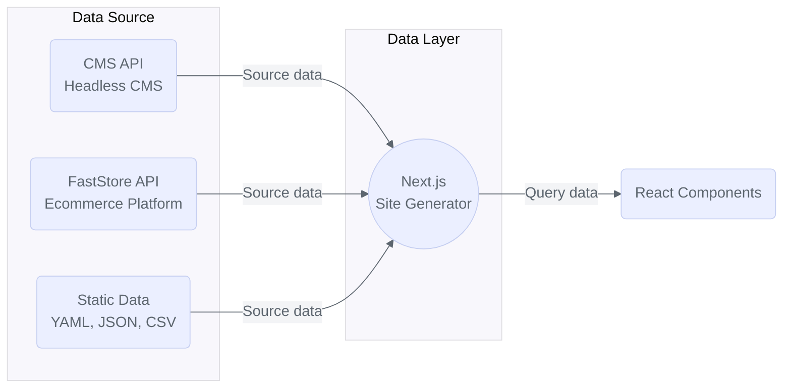

import { Callout, Step, Steps } from 'nextra-theme-docs'

<header>

# FastStore API

</header>

**FastStore API** is an interface between your ecommerce platform and your store's frontend. It uses **[GraphQL](https://graphql.org/)**, a query language for APIs and a runtime for fulfilling queries, in order to expose structured data from everyday ecommerce tasks to frontend components.

The FastStore API allows you to get all the information you need for a given page. 
You can customize your query to get exactly the data you need and even use the [API extension](/docs/api-extensions) feature to fetch data not natively available. Following these best practices helps to maintain your site's performance at optimal levels.

With the FastStore API, you can:

- Retrieve product data.
- Add items to the cart.
- Apply promotions to products.
- Filter search results.

Also, thanks to a type-safe **GraphQL** protocol, the FastStore API allows developers to fetch only the strongly typed data needed for building robust and responsive solutions. 
In practice, developers can source the FastStore API to the [**Next.js**](https://nextjs.org/) data layers and consume it on frontend components to create stores.

<Callout type="info" emoji="ℹ️">
  To learn more about GraphQL and its main concepts, visit the official [GraphQL website](https://graphql.org/).
</Callout>

## Key features

FastStore API is based on [**Schema.org**](https://schema.org/) and inspired by **clean architecture**.

### Improved brand findability

FastStore API extends and simplifies [**Schema.org**](https://schema.org/), a set of agreed definitions for implementing structured data developed by Google, Microsoft, Yahoo, and Yandex.

The Schema markup aids search engines in understanding and displaying your content in a relevant way. It may improve your brand's findability by leading your website to a higher ranking in search results and, as a result, to more clicks and interactions with your store's website.

## Going beyond

Extend the FastStore API schema by leveraging [API extensions](/docs/api-extensions):

- **[Extending API schemas](/docs/api-extensions/extending-api-schema):** Extend VTEX and third-party APIs to customize how data is managed and processed in your store.

- **[Extending queries using fragments](/docs/api-extensions/extending-queries-using-fragments):** Extend GraphQL queries using fragments in FastStore API Extension to add custom fields to predefined queries

- **[Consuming FastStore API extension with custom components](/docs/api-extensions/consuming-api-extensions):** Consume FastStore API extension data with custom components, such as [Sections](/docs/building-sections/creating-a-new-section) and [Override components](/docs/building-sections/overriding-components-and-props).

