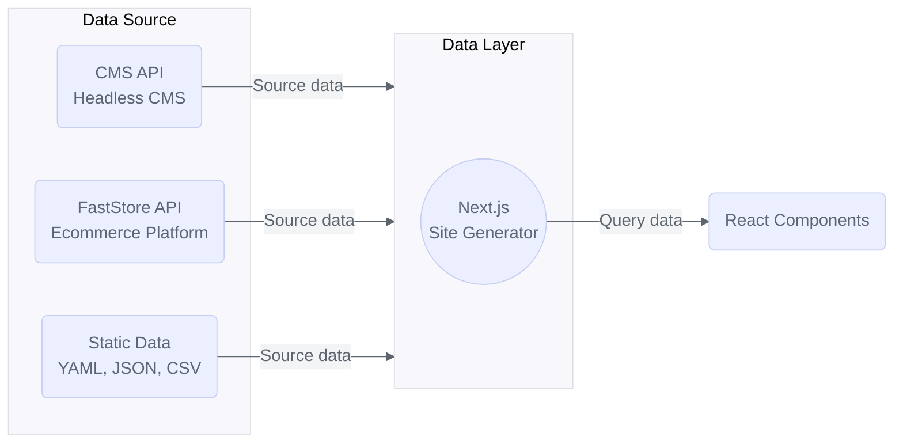

import { Callout, Step, Steps } from 'nextra-theme-docs'

<header>

# FastStore API

</header>

**FastStore API** is an interface between your ecommerce platform and your store's frontend. It uses **[GraphQL](https://graphql.org/)**, a query language for APIs and a runtime for fulfilling queries, in order to expose structured data from everyday ecommerce tasks to frontend components.

The FastStore API allows you to get all information you need for a given page. 
You can customize your query to get exactly the data you need and even use the [API extension](/docs/api-extensions) feature to fetch data not natively available. Following these best practices helps to maintain your site's performance at optimal levels.

With the FastStore API, you can:

- Retrieve product data.
- Add items to the cart.
- Apply promotions to products.
- Filter search results.

Also, thanks to a type-safe **GraphQL** protocol, the FastStore API allows developers to fetch only the strongly typed data needed for building robust and responsive solutions. 
In practice, developers can source the FastStore API to the [**Next.js**](https://nextjs.org/) data layers and consume it on frontend components to create stores.

<Callout type="warning" emoji="⚠️">
  When building your storefront with FastStore, to avoid comprimising the website performance and lead to `504` timeout errors, do not send requests to APIs other than the FastStore API. If you need to access other data not available in the native FastStore API schema, you must do this by using [API extension](/docs/api-extensions). 
</Callout>

<Callout type="info" emoji="ℹ️">
  To learn more about GraphQL and its main concepts, visit the official [GraphQL website](https://graphql.org/).
</Callout>
