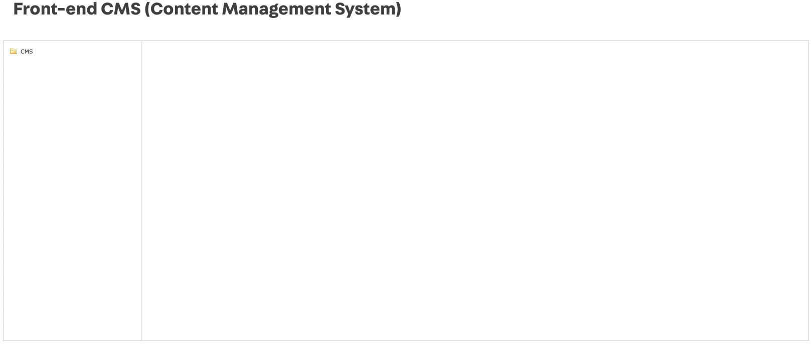
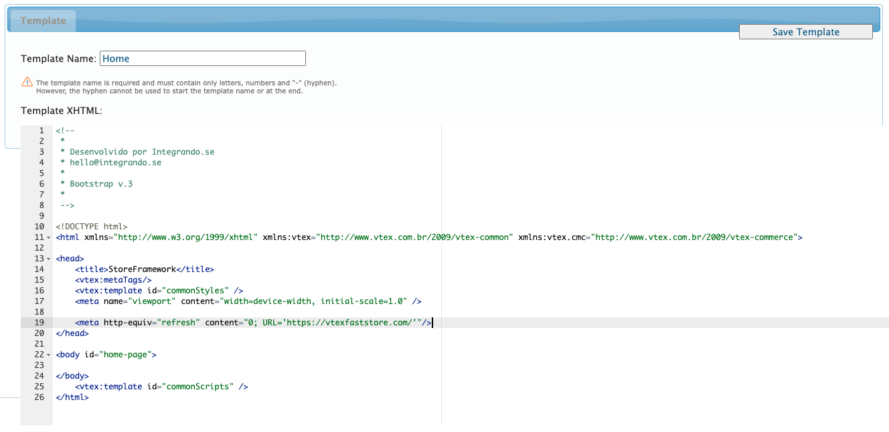

## Making the Login flow work

A few more additional steps are required to make the login flow work as expected. Follow the steps below.

## Step 1 - Add a redirect back to your FastStore store

As defined in the introduction's [step 2](/how-to-guides/integrations/vtex/Introduction#step-2---configure-your-vtex-integration-subdomain), the Login that is being rendered is from the `vtexcommercestable` environment. Therefore, it's necessary to add a redirect back to the FastStore environment after the login conclusion.

1. Access the old CMS. In the left-side navigation menu, find the *CMS* option, under *Store Setup*. You should see this UI:

  

2. Navigate through the folders: click on CMS, then HTML Templates and open the Home file.

3. Add the following script, changing the URL to match your store URL:
   
   `<meta http-equiv="refresh" content="0; URL='https://vtexfaststore.com/'"/>`

4. Clean the script to remove any unecessary part. By the end, your Home file should look like this:

  

5. Click on the `Save Template` button.

  :::caution 
  Notice that as soon as you hit the *Save Template* button, this change will be live to all clients.
  :::

## Step 2 - Set the auth cookie root domain 

Since we are using a subdomain approach, we need to ensure that the auth cookies are set to all subdomains.

Request via ticket that the Identity team from VTEX make this configuration for you, say you need to set the auth cookie root domain to your FastStore URL.
