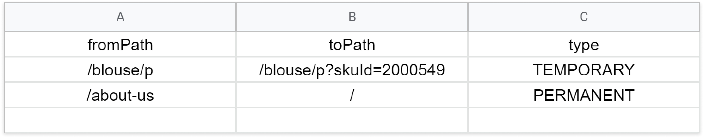

# Managing URL redirects
  
URL redirect is a technique to forward website visitors and search engines from one URL to another. Redirects might be useful when you need to move content to a new URL, remove an old product page, or forward users from a specific region to a custom page.

Implementing the appropriate redirects can improve user experience by preventing visitors from hitting a 404 error page.

Check the following section to learn how to create and delete redirects.

## Step by step

1. Open the `redirects.csv` file located in the root folder of your SFJ project. You can use Excel or Google Sheets, for example.
   
>⚠️ You must not modify the first row of the `redirects.csv` file. Otherwise, you won't be able to create or delete redirects.

2. Under the first row of your `.csv` file, enter the `fromPath`, `toPath`, and `type` values corresponding to the redirects you want to create. Check the meaning and usage of each one of these fields:

| Property name | Description | Example |
|--|--|--|
| `fromPath` | Original path. | `/blouse/p` |
| `toPath` | Relative path or full URL to which you want to redirect your visitors. | `/blouse/p?skuId=2000549` |
| `type` | Redirect type. `TEMPORARY` or `PERMANENT`. | `TEMPORARY` |

Keep in mind that:

- The `fromPath` column can only receive relative paths.
- The `toPath` column can receive either relative paths (e.g., `/blouse/p?skuId=200`) or a full URL (e.g., `https://myotherstore.com`).
- `TEMPORARY` redirects receive the `302` status code, while `PERMANENT` redirects receive the `301` status code.

>ℹ️ If you want to delete a redirect, remove its corresponding values from the `redirects.csv` file.

3. Save and commit your changes.
