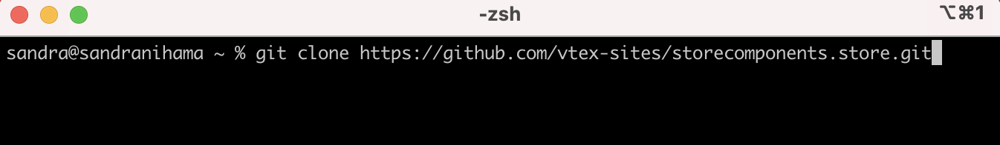
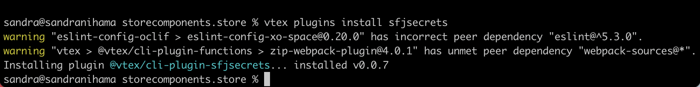
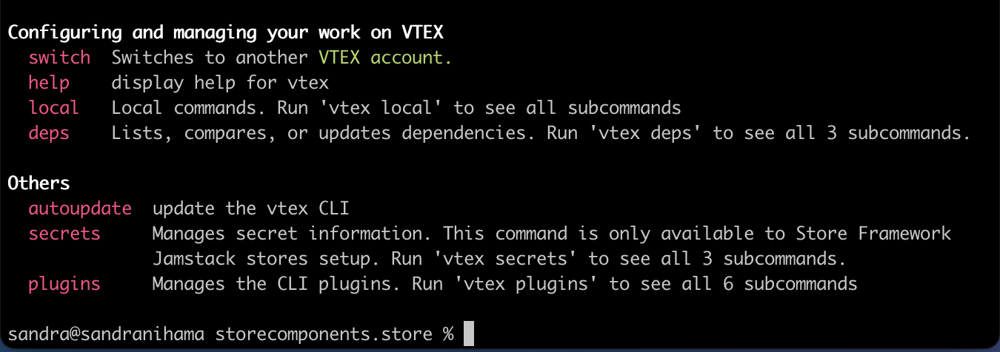
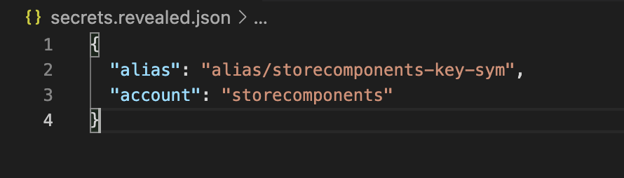

# SFJ Secrets Plugin

> ⚠️ This documentation is temporarily on this repository. It should be moved to the Dev Portal, at this [folder](https://developers.vtex.com/vtex-developer-docs/docs/vtex-io-documentation-vtex-io-cli-installation-and-command-reference), when the Toolbelt 3.x is set.

## Introduction

SFJ Secrets Plugin is a VTEX Toolbelt Plugin that contains commands to manage and update the store secrets. Secrets are credentials, tokens and passwords to access private APIs or dependencies that the store may need in order to be built.

With the aim of giving the store developers more autonomy and control over the secrets they need, all of them are stored safely in the store’s repository itself, in an encrypted file. Therefore, this file can be easily retrieved by authorized users for update whenever needed through SFJ Secrets Plugin. In other words, the plugin allows them to encrypt and decrypt the secrets stored in a file in the store’s repository, so they are kept safe and can be easily manipulated by the store developers.

## Initial Configuration

1. In order to use the plugin, firstly you must have your store repository cloned into your computer.

2. Open the terminal and modify the current directory to your store’s repository root.

3. Then, you must login in VTEX Toolbelt (https://github.com/vtex/toolbelt) using `vtex login` and your credentials.

4. Running vtex, you will be able to find the `secrets` commands on the Others section. If you do not find it, you may install the plugin with `vtex plugins install sfjsecrets`.

### If the store is not configured yet

If you have never used secrets in your store before and do not have the `secrets.hidden.json` file in your repository, it is necessary to do an initial setup.
1. Be sure you are in the root of your repository and that you have the `vtex.env` file.
    1. If you cannot find this file in there, create it and keep it empty.
2. Then, run `vtex secrets setup` command.

This will create an encryption-decryption key for your store and configure your repository so it will be able to receive the secrets. The secrets.revealed.json file will be created in the root of your repository and the `.gitignore` file will be updated with secrets.revealed.json; this way, there is no risk of exposing the secrets by mistake on the remote repository.

Right after running `vtex secrets setup` command, if everything works properly, you will receive a success message in your terminal. Now, you can manage your secrets!

## File Settings

In the `secrets.revealed.json` file, you can add, modify and delete secrets. The file is in JSON format, so all secrets should be added as follows:
` ”name of the secret”: “value of the secret” `

The account and the encryption-decryption key alias are already in the file as an example for the following secrets.

> ⚠️ Do not delete the account item from your file. It is necessary for building the store.

After modifying the file, you must:
Encrypt it by running `vtex secrets hide` command, so the secrets are encrypted and the secrets file extension changes from `secrets.revealed.json` to `secrets.hidden.json`.
By doing this, you will be able to commit the changes and push them into your remote repository safely
Whenever the file needs to be updated, you may run `vtex secrets reveal`, so the secrets will be decrypted and the file extension will change back again to `secrets.revealed.json`.

>⚠️ Always hide your secrets after editing them, so they can be kept safe and can be pushed to the remote repository.

>⚠️[blue note] After committing your code changes into the repository, the build pipeline is able to access the `secrets.hidden.json` file, which has the encrypted secrets, and decrypts it. The secrets will be transformed into environment variables so the build process can correctly happen.