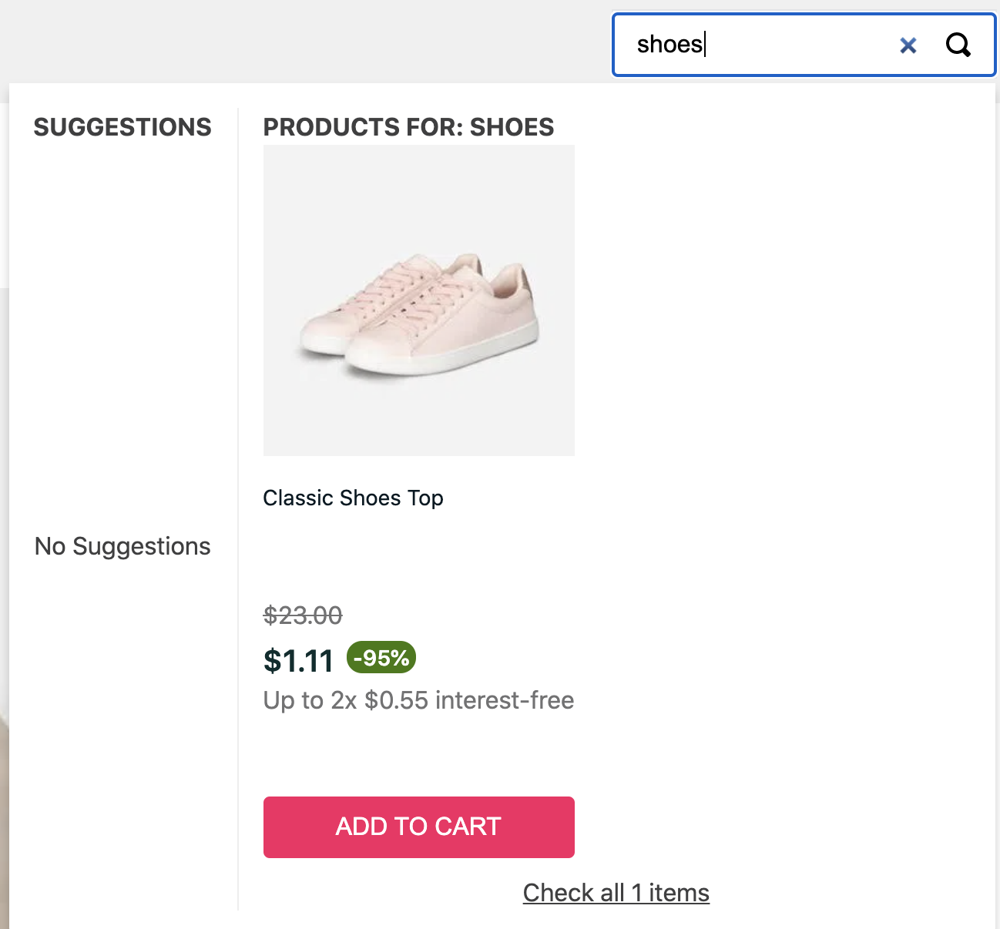

# SFJ Store Theme

The [SFJ Store Theme](https://github.com/vtex/faststore/tree/master/packages/gatsby-theme-store) is a [Gatsby theme](https://www.gatsbyjs.com/docs/themes/what-are-gatsby-themes/#gatsby-themes), a specific plugin type that contains pre-configured functionalities, data sourcing, and UI code defined in a [`/src/gatsby-config.js`](https://github.com/vtex/faststore/blob/master/packages/gatsby-theme-store/src/gatsby-config.ts) file.

Different from a plugin, in a Gatsby theme, default configurations (shared functionality, data sourcing, UI code) are abstracted into an installable package.

This way, Gatsby themes make it possible to control site styling through decoupled packages, characterized for version control and autonomous updates.

For being packaged as a standalone product, it is also possible to have more than one theme on the same site.

The SFJ Store Theme incorporates VTEX ecommerce solutions by configuring the following plugins:

- [`@vtex/gatsby-plugin-theme-ui`](https://github.com/vtex/faststore/tree/master/packages/gatsby-plugin-theme-ui) - Allows theme styling and optimizes the way CSS is merged. Leveraging from the [Theme UI](https://theme-ui.com/), this plugin incorporates the [Store UI library](https://github.com/vtex/faststore/tree/master/packages/store-ui) - a library that contains storefront components, such as the [Minicart](https://github.com/vtex/faststore/tree/master/packages/store-ui/src/Minicart).
- [`@vtex/gatsby-plugin-i18n`](https://github.com/vtex/faststore/tree/master/packages/gatsby-plugin-i18n) - Allows store internationalization.
- [`@vtex/gatsby-plugin-graphql`](https://github.com/vtex/faststore/tree/master/packages/gatsby-plugin-graphql) - Builds and preprocesses VTEX store's GraphQL queries.

# Styling

In the Store Framework Jamstack (SFJ), styling can be achieved by:

- [Overwriting CSS styles of the Store UI components.](#overwriting-css-styles-of-the-store-ui-components)
- [Adding styles to React components from the Store UI library.](#adding-styles-to-react-components-from-the-store-ui-library)
- [Creating your own components and styles.](#creating-your-own-components-and-styles)

In the following sections, you'll find out more about each one of these topics.

However, before proceeding any further, keep in mind that styling is possible thanks to the `@vtex/gatsby-plugin-theme-ui` plugin. 

We structure the `@vtex/gatsby-plugin-theme-ui` code within multiple files to improve readability. However, the `@vtex/gatsby-plugin-theme-ui` plugin only considers the styles exported by the `createTheme` function inside the `index.ts` file.

    ```ts
    // @vtex/gatsby-plugin-theme-ui/index.ts
    export default createTheme(
      base,
      breadcrumb,
      minicart,
      infoCardTheme,
      headerTheme,
      productQuantityTheme,
      minicartTheme,
      searchControlsTheme,
      searchSuggestionsTheme,
      searchBarTheme,
      searchTheme,
      custom,
      sliderTheme,
      offerTheme,
      productSummaryTheme,
      productDetailsTheme,
      loginTheme,
      authTheme
    )
    ```
## Step by step

### Overwriting CSS styles of the Store UI components

Take the following steps as a guide to style Store UI components containing a pre-defined `themes.ts` style sheet.

Once you [set up your SFJ project]() from our [SFJ starter](https://github.com/vtex-sites/storecomponents.store), you're ready to start styling your VTEX store.  

1. Open up your SFJ project in the code editor of your choosing.
2. Go to the `src/@vtex/gatsby-plugin-theme-ui`.
3. Create a Typescript file with the name of the component you want to style (e.g., `searchSuggestions.ts`).

>ℹ️  *Use the [SFJ Store Theme components folder](https://github.com/vtex/faststore/tree/master/packages/gatsby-theme-store/src/components) as a reference.*

4. Import the `createTheme` function and the pre-defined style sheet of the component you want to style.
    
    ```ts
    import { createTheme, SxStyleProp } from '@vtex/store-ui'
    ```
    
>⚠️  *Ideally, all default style sheets should be defined within the Store UI library. However, you'll notice some styles are defined within the SFJ Store Theme. We are aware of this situation and already working on it.*

5. Declare a `custom` object, as in the following:

    ```ts
    const custom = {
    
    }
    ``` 

6. Within the `custom` object, overwrite styles respecting the hierarchy of the style sheet of that component.

>⚠️  *Open the default style sheet file of the component you want to style and check the hierarchy you should follow when overwriting styles.*

Take the following example from the [SearchSuggestions default style sheet (`@vtex/gatsby-theme-store/src/components/SearchSuggestions/theme.ts`)](https://github.com/vtex/faststore/blob/master/packages/gatsby-theme-store/src/components/SearchSuggestions/theme.ts). By default, we have:
    
    ```ts
    // "faststore/packages/gatsby-theme-store/src/components/SearchSuggestions/theme.ts"
        products: {
          width: 'inherit',
    
          button: {
            backgroundColor: 'primary',
          },
    
          title,
    
          list: {
            ...list,
            display: 'flex',
            flexWrap: 'nowrap',
          },
    
          total: {
            paddingTop: '10px',
            color: 'text',
            textDecoration: 'underline',
            textAlign: 'center',
            cursor: 'pointer',
            width: '100%',
            backgroundColor: 'white',
          },
        },
    ```


>⚠️  ***Keep in mind**: If you don't respect the component style sheet hierarchy and names, you'll face issues when overwriting styles.*

To customize this style, we must stick to this hierarchy. Take the following example in which we customized the add-to-cart button from the `searchSuggestions` component by changing the `backgroundColor` property from `primary` to `secondary`.



    ```ts
    // "src/@vtex/gatsby-plugin-theme-ui/searchSuggestions.ts"
    import { createTheme, SxStyleProp } from '@vtex/store-ui'
    import searchSuggestionsTheme from '@vtex/gatsby-theme-store/components/SearchSuggestions/theme'
    
        const custom{
          button: {
            backgroundColor: 'secondary',
          }
        }
    ```

7. At the end of the file, create a `searchSuggestionsCustom` variable that provides the default theme and the `custom` theme you created to the `createTheme` function.

    ```ts
    const searchSuggestionsCustom = createTheme(searchSuggestionsTheme, custom)
    ```

8. Export the object created in the previous step.

    ```ts
    export default searchSuggestionsCustom
    ```

9. Save your changes and close this file.
10. Go to the `src/@vtex/gatsby-plugin-theme-ui/index.js` file.
11. Import the style you created in the previous steps . Take the following example:

    ```js
    import searchSuggestionsCustom from './searchSuggestions'
    ```
    
12. Export the theme in the `createTheme` function.

    
    ```js
    export default createTheme(
      searchSuggestionsCustom,
      ...
    )
    ```

7. Save your changes.

>ℹ️  ***Keep in mind**: [Shadowing](shadowing.md) only occurs on the `@vtex/gatsby-plugin-theme-ui/index` file.*

8. Run `gatsby deploy` to start a development server and check your changes live at `http://localhost:8000/`.


## Adding styles to React components from the Store UI library

Leveraging from the [Theme UI](https://theme-ui.com/), the `@vtex/gatsby-plugin-theme-ui` plugin incorporates the [Store UI library](https://github.com/vtex/faststore/tree/master/packages/store-ui) - a library that contains storefront components, such as the [Minicart](https://github.com/vtex/faststore/tree/master/packages/store-ui/src/Minicart).

In this sense, we can benefit from the [Variants](https://theme-ui.com/guides/variants/) feature from the Theme UI library.

>ℹ️ *Variants allow you to add groups of styles based on a component value. It works as classes in CSS.*

Take the following example from the [`Header`](https://github.com/vtex/faststore/blob/master/packages/gatsby-theme-store/src/components/Header.tsx) component of the Store UI library:

    ```tsx
     const variant = 'header'

    ...

      <Flex variant={`${variant}.left`}>
        <Logo variant={`${variant}.logo`}/>
        <Menu variant={`${variant}.menu`}/>
      </Flex>
    
    ...

    ```

Since, in this case, the `variant` name is `header`, we should add styles to this component as in the following:

    ```ts
    {
      header:{
    	  left: {
    	    color: 'white',
          bg: 'secondary',
    	  },
    	   logo: {
            text: '#000',
            background: '#fff',
            primary: '#0c7',
         },
        menu{
            body: 'system-ui, sans-serif',
            heading: 'Poppins, sans-serif',
        }
    }
    ```

Therefore, to add new styles to a Store UI component, check the name of its variants inside the `.tsx` file. Then, pass the variants as props, containing the desired styles.

1. Open up your SFJ project in the code editor of your choosing.
2. Go to the `src/@vtex/gatsby-plugin-theme-ui/index.js` file.
3. Import the style of the component you want to style. 

>ℹ️ *Use the [SFJ Store UI library](https://github.com/vtex/faststore/tree/master/packages/store-ui) as a reference.*

Take the following example:

    ```js
    import headerTheme from '@vtex/store-ui'
    ```
    
4. Define styles inside the `src/@vtex/gatsby-plugin-theme-ui/index.js` file.

>ℹ️ *Check the name of the variants inside the component's `.tsx` source file. Then, pass the variants as props with the desired styles.*

5. Save your changes.
6. Run `gatsby deploy` to start a development server and check your changes live at `http://localhost:8000/`.
