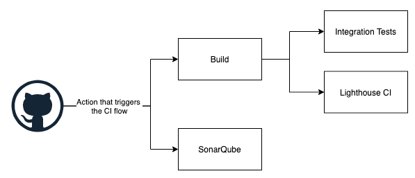
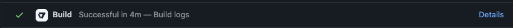
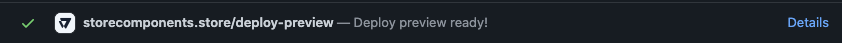
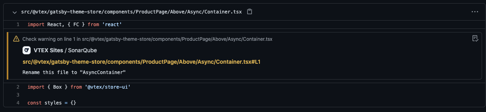
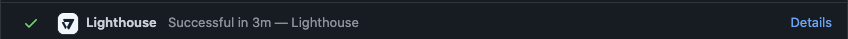
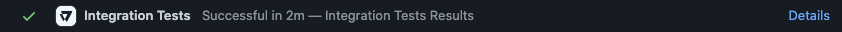
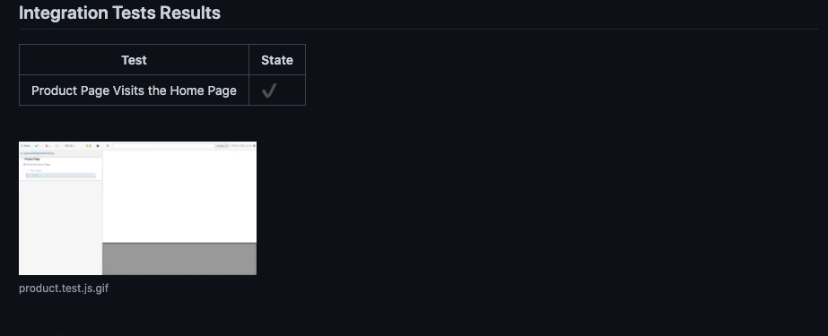

## Steps of the pipeline
Store Framework Jamstack CI flow consists 4 main steps: `Build`, `SonarQube`, `Integration Tests` and `Lighthouse CI`. 

This flow is triggered by two situations:
1. When a pull request is created.
2. When a push with commits associated to a pull request is made.

When this happens, a `check suite` is created and populated with `check runs` that shows the state of each step.  
The initial state of each step is `queued`. This indicates that soon they will be executed.

## Build

This step is reponsible of two main things:

### Build the store
- Run an automated build for the store, saving all the generated artifacts in our infrastructure.
- Send the build logs to GitHub.
The build logs are visible by clicking on `details` on the `Build` check run once its completed.

#### Possible states
- `queued`: soon this step will be executed.
- `in_progress`: this step is being executed.
- `completed/success`: the build is completed successfuly.
- `completed/failure`: the build is completed but something went wrong.

### Generate a deploy preview 
For each pull request we provide a `Deploy Preview` that is a deploy of the most recent changes of the pull request.
You can access the `Deploy Preview` of a specific Pull Request by clicking on `details` on the commit status with the title `<your store>/deploy-preview`:  

Or directly on this url: `https://preview-<pull request number>--<your store name>.vtex.app/`.  
For example: `https://preview-417--storecomponents.vtex.app/`.

## SonarQube

[SonarQube](sonarqube.md) is used to measure and analyze code quality using static analysis.

Everytime that the CI flow is triggered, a static analysis of the code is made taking into account the latest changes of the pull request. If any issues are found by sonarqube, they will be marked as annotations on the pull request like so:

#### Possible states
- `queued`: soon this step will be executed.
- `in_progress`: this step is being executed.
- `completed/success`: Sonarqube didn't found any critial issues.
- `completed/failure`: There is at least one critical issue found by sonarqube.

More information can be found [here](./sonarqube.md)

## Lighthouse CI

Lighthouse is a tool that is used to monitor the performance of a website, and it is executed each time a new build is completed, using the `Deploy Preview` as the source of analysis. This results are agregated and allows the developer to compare the performance of whats being developed with what is in production.  

You can access the execution logs by clicking on `details` at the `Lighthouse` check.  

#### Possible states
- `queued`: soon this step will be executed.
- `in_progress`: this step is being executed.
- `completed/success`: Lighthouse CI is completed successfuly.
- `completed/failure`: Something went wrong.
- `completed/canceled`: The build was not successfull, therefore the Lighthouse CI can't be executed.

## Integration Tests

Store Framework Jamstack CI flow support integration tests implemented with Cypress.
Each time a build is completed, the integrations tests are executed using as url the `Deploy Preview` generated with the latest changes on the current pull request.

The results of the tests can be seen directy on GitHub, by clicking on `details` at the `Integration Tests` check.

More information can be found [here](./e2e-testing.md)

#### Possible states
- `queued`: soon this step will be executed.
- `in_progress`: this step is being executed.
- `completed/success`: All tests passed successfuly.
- `completed/failure`: At least one test failed.
- `completed/canceled`: The build was not successfull, therefore the Integrations Tests can't be executed.
- `completed/neutral`: There are no integration tests implemented.
