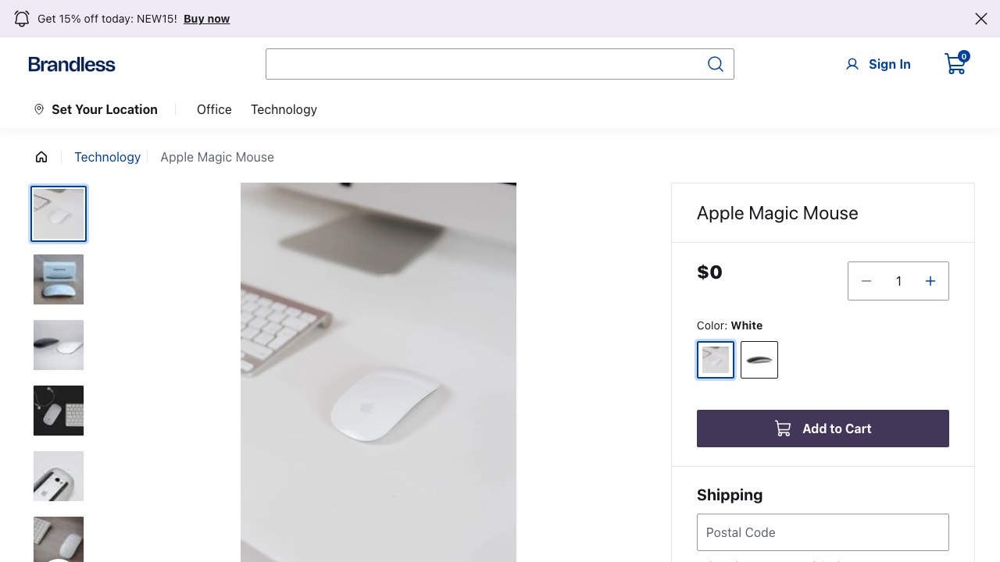
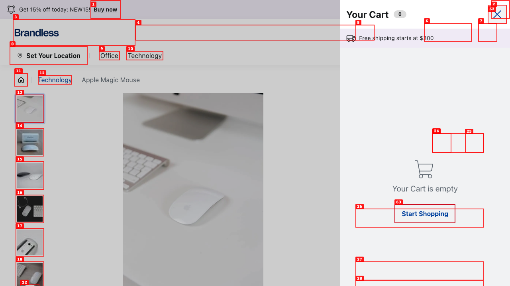
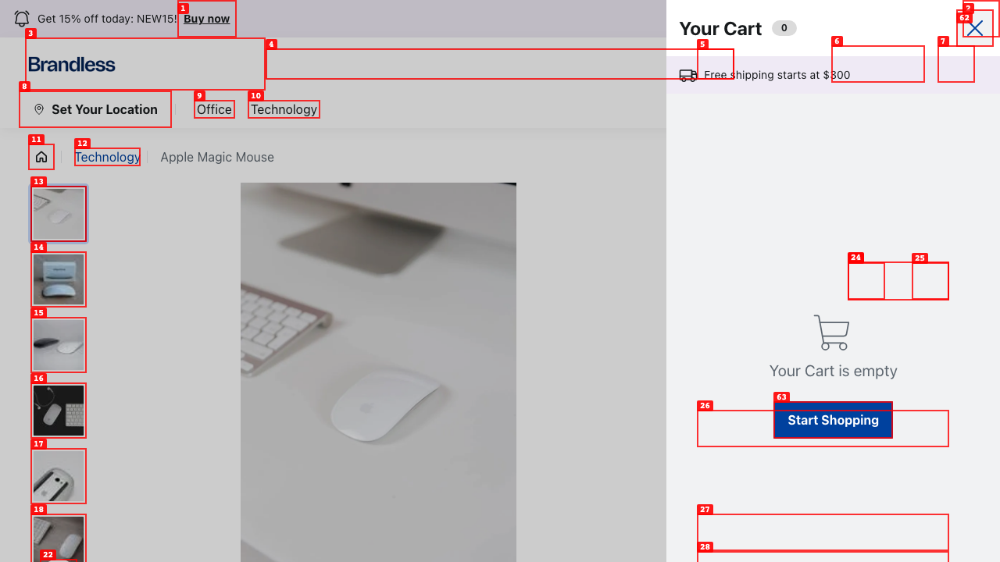
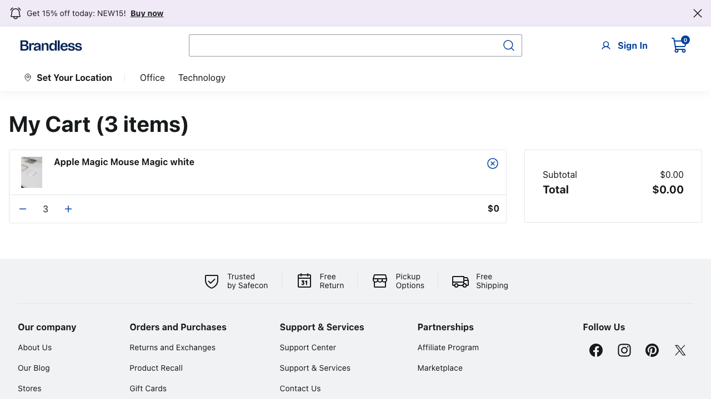
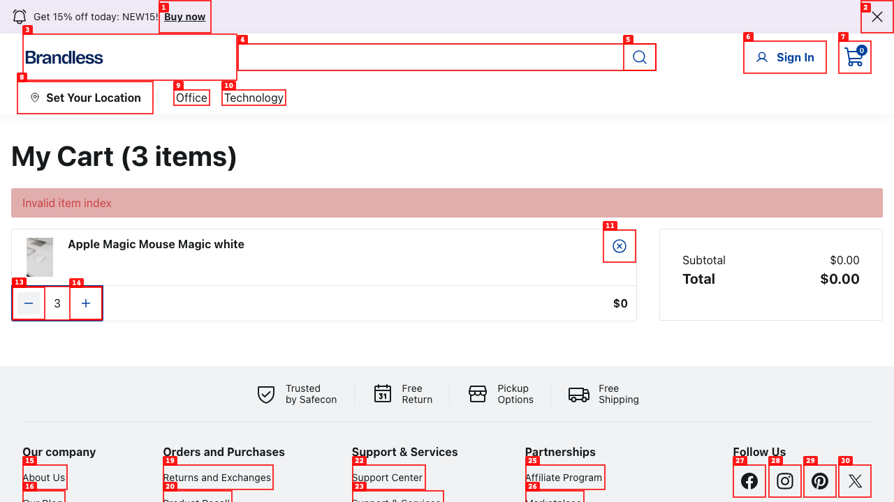
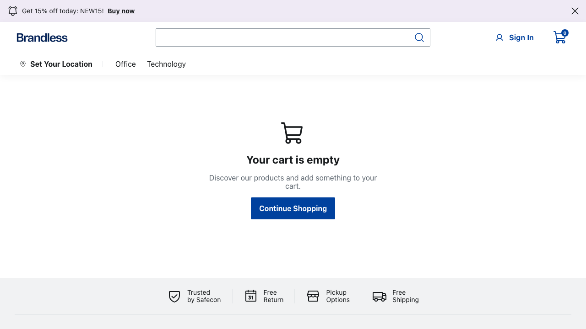
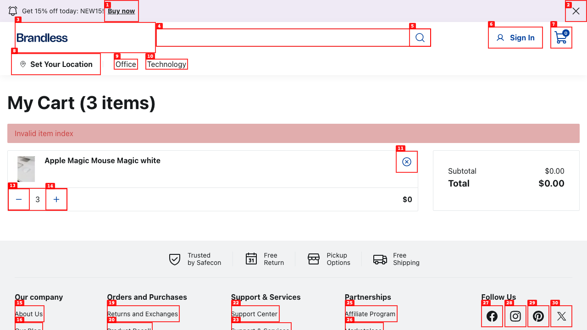
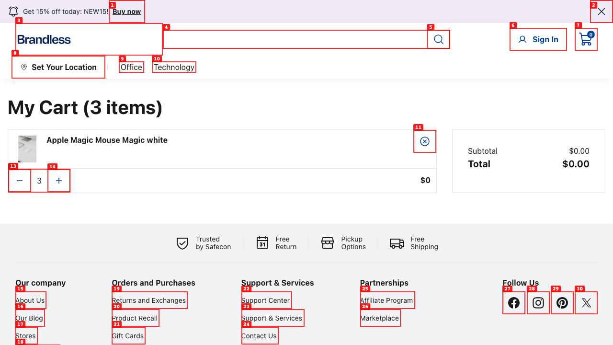

# Dogfood Report: FastStore

| Field | Value |
|-------|-------|
| **Date** | 2026-03-05 |
| **App URL** | http://localhost:3000/cart |
| **Session** | faststore-cart |
| **Scope** | Cart page (/cart) only |

## Summary

| Severity | Count |
|----------|-------|
| Critical | 2 |
| High | 3 |
| Medium | 1 |
| Low | 1 |
| **Total** | **7** |

## Issues

### ISSUE-001: Cart sidebar shows empty after Add to Cart (item is actually added)

| Field | Value |
|-------|-------|
| **Severity** | high |
| **Category** | functional |
| **URL** | http://localhost:3000/apple-magic-mouse-21474846/p |
| **Repro Video** | videos/issue-001-repro.webm |

**Description**

Clicking "Add to Cart" on the product detail page (Apple Magic Mouse) opens the cart sidebar, but the sidebar always shows "Your Cart is empty" with a count of 0, even though the item IS actually being added to the cart (confirmed by navigating to /cart page). The sidebar never updates to reflect the cart state. This is misleading — users believe the add to cart failed when it actually succeeded.

**Repro Steps**

1. Navigate to a product detail page (e.g., Apple Magic Mouse)
   

2. Click "Add to Cart" button — the cart sidebar opens but shows "Your Cart is empty" with count 0
   

3. **Observe:** Sidebar shows empty cart, but navigating to /cart reveals the item was added.
   

---

### ISSUE-002: All product prices display as $0 on cart page

| Field | Value |
|-------|-------|
| **Severity** | critical |
| **Category** | functional |
| **URL** | http://localhost:3000/cart |
| **Repro Video** | N/A |

**Description**

On the /cart page, the product line item price shows "$0", the Subtotal shows "$0.00", and the Total shows "$0.00". The Apple Magic Mouse (which costs $379.99 on the PDP) displays a price of $0 in the cart. This means the cart cannot display accurate pricing to the user, making checkout impossible even if it were available.

**Repro Steps**

1. Navigate to /cart with an item in the cart.
   

2. **Observe:** Product price shows "$0", Subtotal is "$0.00", Total is "$0.00".

---

### ISSUE-003: Quantity controls (increment/decrement) throw "Invalid item index" error

| Field | Value |
|-------|-------|
| **Severity** | critical |
| **Category** | functional |
| **URL** | http://localhost:3000/cart |
| **Repro Video** | videos/issue-003-repro.webm |

**Description**

Clicking the increment (+) or decrement (-) quantity buttons on a cart item displays an "Invalid item index" error banner at the top of the cart. The quantity does not change. Both buttons trigger the same error. The error message "Invalid item index" is also unclear to end users.

**Repro Steps**

1. Navigate to /cart with an item in the cart (quantity = 3).
   

2. Click the "+" (Increment Quantity) button.
   

3. **Observe:** A red error banner appears saying "Invalid item index". Quantity remains at 3. Same happens with the "-" button.
   

---

### ISSUE-004: Remove item button is unresponsive (also throws "Invalid item index")

| Field | Value |
|-------|-------|
| **Severity** | high |
| **Category** | functional |
| **URL** | http://localhost:3000/cart |
| **Repro Video** | videos/issue-004-remove.webm |

**Description**

The remove item button (X icon) on the cart item cannot be clicked via normal user interaction — it times out. When clicked via JavaScript, it shows the same "Invalid item index" error. Users cannot remove items from their cart. The button appears visually interactable but does not respond to clicks within a reasonable timeout.

**Repro Steps**

1. Navigate to /cart with an item in the cart.
   

2. Click the X (remove) button next to the product name.

3. **Observe:** Button does not respond. When force-clicked, shows "Invalid item index" error.
   

---

### ISSUE-005: No Checkout/Proceed button on cart page

| Field | Value |
|-------|-------|
| **Severity** | high |
| **Category** | ux |
| **URL** | http://localhost:3000/cart |
| **Repro Video** | N/A |

**Description**

The cart page has no "Checkout", "Proceed to Checkout", or any equivalent CTA button. After adding items to the cart, users have no way to proceed with their purchase. The order summary section shows Subtotal and Total but no actionable button to complete the flow. This is a dead-end — users cannot advance beyond the cart.

**Repro Steps**

1. Navigate to /cart with items in the cart.
   

2. **Observe:** Only Subtotal and Total are shown in the order summary. No checkout button exists anywhere on the page.

---

### ISSUE-006: Cart page has empty page title

| Field | Value |
|-------|-------|
| **Severity** | medium |
| **Category** | content |
| **URL** | http://localhost:3000/cart |
| **Repro Video** | N/A |

**Description**

The cart page (`/cart`) has an empty `<title>` tag. The browser tab shows no text. Expected something like "My Cart | Brandless" or similar. This affects SEO, accessibility (screen readers announce the page title), and general usability (users can't identify the tab).

**Repro Steps**

1. Navigate to /cart.
   

2. **Observe:** Browser tab shows no title. `document.title` returns an empty string.

---

### ISSUE-007: "My Cart (3 items)" count is misleading — counts quantity, not unique products

| Field | Value |
|-------|-------|
| **Severity** | low |
| **Category** | ux |
| **URL** | http://localhost:3000/cart |
| **Repro Video** | N/A |

**Description**

The cart heading shows "My Cart (3 items)" when there is only 1 unique product (Apple Magic Mouse) with a quantity of 3. The word "items" suggests 3 different products, which is misleading. While technically correct that there are 3 units, the phrasing is confusing. Consider "My Cart (1 product, 3 units)" or simply "My Cart (1 item)" where the quantity is visible in the item row.

**Repro Steps**

1. Navigate to /cart with 1 product at quantity 3.
   

2. **Observe:** Heading says "My Cart (3 items)" but only 1 product row is visible.

---

