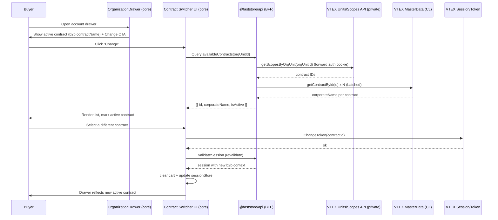

# Contract Switcher

> **Status**: Approved
> **Created**: 2026-06-04

> **References**
> - PRD: Phase 2 — Contract Switching and Selection (REQ-03 to REQ-06)
> - RFC: [FrontEnd - FastStore] Contract Switcher
> - Figma: [B2B · Multi-contract Organizations, node 103-5434](https://www.figma.com/design/I29WnCgD55t0mlAxtWPGzO/B2B-%C2%B7-Multi-contract-Organizations?node-id=103-5434&m=dev)

## 1. Business Context

### Problem Statement

A B2B buyer can belong to an Organization Unit (Org Unit) that has **multiple commercial contracts** (e.g. different corporate agreements, price tables, payment terms). Today the FastStore storefront only ever reflects a **single active contract** — `validateSession` resolves one `b2b.contractName` and there is no way for the buyer to see or change which contract they are operating under.

This forces merchants to duplicate users or Org Units to support buyers who legitimately purchase under more than one agreement, and it creates the risk of a buyer unknowingly purchasing under the wrong contract.

The contract context must be set **inside FastStore**, before the buyer enters the Organization Account application, because every downstream action (browsing, pricing, cart, checkout, Org Account) must run under the selected commercial context.

**Who is affected:** B2B buyers (operate under the right agreement) and B2B merchants (keep contract access governed without user/Org-Unit duplication).

### Goals

Deliver **Phase 2 — Contract Switching and Selection**: buyers and merchants can intentionally operate under different contracts within the same Org Unit, without duplicating users or Org Units.

- A buyer can change the active contract among those associated with their Org Unit.
- The active contract is unambiguously visible before any action is taken.
- A switch is a **full change of commercial context** — all subsequent actions execute under the new contract.
- Contract access stays governed: only the Org Unit's contracts are selectable.

### User Stories

#### US-1 (REQ-03): Change the active contract

- **Story**: As a B2B buyer, I want to change the active contract within my Org Unit, so that I can purchase under a different commercial agreement when multiple contracts are available.
- **Acceptance Criteria**:
  - **Given** a buyer whose Org Unit has 2+ contracts, **when** they open the switcher and select a different contract, **then** the switch is applied and the newly selected contract becomes the active commercial context.
  - **Given** a successful switch, **when** the buyer returns to the drawer/storefront, **then** the active contract reflects the new selection.

#### US-2 (REQ-04): Understand which contract is active

- **Story**: As a B2B buyer, I want to clearly understand which contract is currently active before performing actions, so that I do not operate under the wrong agreement.
- **Acceptance Criteria**:
  - **Given** the account drawer is open, **when** the buyer views it, **then** the currently active contract is shown by human-readable corporate name.
  - **Given** the switcher list is open, **when** the buyer scans the options, **then** the active contract is visually marked as selected/current.

#### US-3 (REQ-05): Governed contract access

- **Story**: As a B2B merchant, I want buyers to switch contracts only among those already associated with their Org Unit, so that contract access stays governed.
- **Acceptance Criteria**:
  - **Given** a buyer in an Org Unit, **when** the switcher loads, **then** only contracts associated with that Org Unit are listed and selectable.
  - **Given** a contract not associated with the Org Unit, **when** the list renders, **then** it never appears as an option.

#### US-4 (REQ-06): Full change of commercial context

- **Story**: As a B2B merchant, I want a contract switch to be a full change of commercial context, so that all subsequent buyer actions execute under the newly selected contract.
- **Acceptance Criteria**:
  - **Given** a buyer selects a new contract, **when** the switch succeeds, **then** the session is updated (`ChangeToken` followed by session revalidation) and downstream calls (PLP/PDP pricing, cart, checkout, Org Account) run under the new contract.
  - **Given** the context changed, **when** there is an in-flight cart, **then** the cart is cleared/reset so the buyer starts a clean commercial context under the new contract.

### Key Scenarios

| Scenario | Pre-conditions | Steps | Expected Result |
|---|---|---|---|
| Switch contract (happy path) | Buyer with 2+ contracts, ChangeToken wired, drawer open | Click **Change** → list opens → select another contract → confirm | `ChangeToken` returns true → session revalidation → cart cleared; active contract updates; next action runs under the new contract |
| ChangeToken not yet wired | Buyer with 2+ contracts, Confirm visible only when `isContractSwitchEnabled` | Open switcher, select contract | Confirm stays disabled; cart and session are not mutated |
| Active contract visibility | Drawer open | View drawer header and switcher list | Active contract shown by corporate name in the header and marked as current in the list |
| Governance | Buyer in an Org Unit with N contracts | Open switcher | Only the Org Unit's contracts appear; no others are selectable |
| Single / no alternative contract | Buyer's Org Unit has exactly one (or zero alternative) contract | Open switcher | Empty/disabled state shown ("no other contracts available"); **Change** CTA is hidden or disabled |
| Loading | Slow scopes/MasterData responses | Open switcher | Loading state shown until the list resolves |
| Error on load | Scopes or MasterData call fails | Open switcher | Error state with retry; no partial/garbled list |
| Error on switch | `ChangeToken` or revalidation fails | Select a contract | Error message shown; the **previous** contract stays active; no partial context change |
| Name resolution | Scopes returns only contract IDs | Open switcher | Each contract is displayed by its corporate name, never a raw ID |
| Context propagation | Switch just succeeded | Open Organization Account / start a purchase | The downstream action reflects the new contract |

### Functional Requirements

- **FR-1** A **Change** CTA is rendered next to the active contract in the FastStore account drawer (Org Unit / contract area, Figma node 103-5434).
- **FR-2** Activating the CTA opens a switcher that lists **only** the contracts associated with the buyer's Org Unit.
- **FR-3** Each contract is displayed by its **human-readable corporate name** (not a raw ID).
- **FR-4** The currently active contract is clearly indicated in the list.
- **FR-5** Selecting a contract applies the change when `ChangeToken` confirms a context change: session revalidation runs and the active contract reflects the new selection. While ChangeToken is unwired, Confirm is disabled and no session/cart mutation occurs.
- **FR-6** On a successful switch the in-flight cart is cleared/reset.
- **FR-7** Loading, empty (single/no alternative), and error states are handled for both list load and switch apply.
- **FR-8** On switch failure, the previous contract remains active and the user is informed.
- **FR-9** The feature works on supported breakpoints (desktop/mobile) per Figma.

### Non-Functional Requirements

- **Governance/Security**: the available-contracts list is derived from the buyer's own Org Unit; private VTEX routes are reached only through the `@faststore/api` BFF using the buyer's forwarded auth cookie (`withAutCookie`) — never exposing app keys to the client. Changes here touch authentication/session and require the human-approval note per the repo's Security & Data Handling rules.
- **Performance**: the switcher fetches data on demand (when opened), not on initial page load, to protect TTFB/Core Web Vitals. Corporate-name resolution should batch/parallelize the per-contract MasterData lookups.
- **Accessibility**: the switcher is keyboard-navigable, the active contract is conveyed non-visually (e.g. `aria-current`/selected state), and loading/error/empty states are announced.
- **Resilience**: list-load and switch-apply failures are isolated — a failed name lookup for one contract must not break the whole list.

### Out of Scope

- Contract creation / association management (governed by the merchant elsewhere).
- Switching contracts **inside** the Organization Account application (separate task, if applicable).
- Backend changes to Scopes / MasterData / Experience APIs beyond **consuming** them.
- Multi-Org-Unit switching (this feature switches contracts **within** a single Org Unit).

---

## 2. Arch Decisions

### Proposed Solution

Extend the existing B2B account drawer (`OrganizationDrawer`) with a **Contract Switcher sub-view**. The drawer header gains a **Change** CTA that toggles the drawer into a list view of the Org Unit's contracts. Selecting a contract calls a new switch flow that performs `ChangeToken` + session revalidation, clears the cart, and returns to the drawer reflecting the new active contract.

Data is served by `@faststore/api` (the BFF), reusing the **already-wired** VTEX clients:

- `units.getScopesByOrgUnit({ orgUnitId })` → contract IDs associated with the Org Unit (private route, authenticated via the forwarded `VtexIdclientAutCookie`).
- `masterData.getContractById({ contractId })` → resolves each ID to its `corporateName`.

A new GraphQL query exposes the resolved list to the storefront; a new switch operation performs the context change. No new client-side secret handling is introduced.

### Architecture Overview



### Alternatives Considered

| Alternative | Pros | Cons | Verdict |
|---|---|---|---|
| **Scopes + MasterData via BFF (chosen)** | Clients already exist in `@faststore/api`; auth workaround already solved; no new infra | Two-step fetch (IDs → names); extra MasterData calls | **Accepted** — fastest path to delivery |
| Experience APIs (single source returning names) | One call, no name-resolution step; aligns with future vision | Not confirmed available at implementation time; would block delivery | Rejected for now; revisit once available (see Decision 1) |
| Resolve contracts client-side directly against private routes | — | FastStore cannot natively authenticate to private routes from the browser; leaks credentials | Rejected |
| Embed full contract list in `validateSession` | Reuses existing session flow | Bloats every session validation with B2B-only data; performance cost on all users | Rejected — fetch on demand instead |

### Risks & Mitigations

| Risk | Impact | Likelihood | Mitigation |
|---|---|---|---|
| `ChangeToken` endpoint/contract not yet defined in code | High | High | Behind a thin client in the BFF; documented as an open integration point (Decision 2). Implementation blocked on confirming the endpoint. |
| Extra MasterData calls for name resolution slow the list | Med | Med | Fetch on drawer-open only; batch/parallelize; cache per session |
| Partial failure leaves an inconsistent commercial context | High | Low | Treat switch as atomic: only update `sessionStore`/clear cart **after** `ChangeToken` + revalidation succeed; on failure keep previous contract |
| In-flight cart priced under the old contract | High | Med | Clear/reset cart on successful switch (Decision 3) |
| Touching session/auth without approval | Med | Low | Flag auth/session impact in the PR description per repo Security rules |

### Key Decisions

#### Decision 1: Data source = Scopes + MasterData (via the BFF), abstracted for a future Experience API

- **Status**: Accepted
- **Context**: The list of available contracts can come from the Unit/Scopes API (IDs) + MasterData (names), or from a future Experience API. The Scopes/MasterData clients already exist in `@faststore/api`.
- **Decision**: Implement against Scopes + MasterData now, exposed through a new GraphQL query. Keep the resolver behind a single boundary so the data source can be swapped to an Experience API later without changing the storefront contract.
- **Consequences**: Ships now with no new infra. Carries the two-step fetch cost. The storefront-facing GraphQL contract is stable across a future source swap.

#### Decision 2: `ChangeToken` + session revalidation as the switch mechanism — endpoint is an OPEN question

- **Status**: Accepted (mechanism), Open (concrete endpoint)
- **Context**: The PRD/RFC require that a switch be a full change of commercial context via `ChangeToken` followed by `revalidateSession`. Neither `ChangeToken` nor an explicit `revalidateSession` mutation exists in the codebase today; session refresh exists via the `validateSession` GraphQL mutation and `sessionStore`.
- **Decision**: Model the switch as: (1) call `changeContractToken(contractId)` which returns `true` only when the VTEX B2B token/session endpoint confirms the commercial context changed, then (2) revalidate the FastStore session (re-run `validateSession` so `b2b` reflects the new contract) and update `sessionStore`. While the endpoint is unwired, `changeContractToken` returns `false`, `isContractSwitchEnabled` is `false`, and Confirm is disabled so cart/session are never mutated as a no-op.
- **Consequences**: The flow is defined; the precise VTEX route/payload for `ChangeToken` is a documented blocker to resolve during implementation.

#### Decision 3: Clear the cart on a successful switch

- **Status**: Accepted
- **Context**: A switch is a full change of commercial context; an in-flight cart was priced/validated under the previous contract.
- **Decision**: On a successful switch, clear/reset the cart so the buyer starts a clean commercial context under the new contract. `sessionStore.set` already triggers cart revalidation; the switch flow additionally clears cart contents.
- **Consequences**: Predictable pricing under the new contract; the buyer loses an in-progress cart on switch (acceptable given the "full change of context" requirement).

#### Decision 4: UI is a sub-view inside the existing `OrganizationDrawer`

- **Status**: Accepted
- **Context**: Figma node 103-5434 shows the switcher reachable from the account drawer header.
- **Decision**: Add the **Change** CTA to `OrganizationDrawerHeader` and render the switcher as a sub-view/state of `OrganizationDrawer` (toggle between "menu" and "switch contract"), rather than a separate modal. Reuse existing FastStore/`@faststore/ui` primitives.
- **Consequences**: Consistent with current drawer UX and styling; keeps the active-contract indicator and switch list in one place.

#### Decision 5: Governed contract IDs = `contractIds` scope only (Suma BFF alignment)

- **Status**: Accepted
- **Context**: Org Unit scopes include multiple kinds (`contractIds`, `priceIds`, `collectionIds`, etc.). Only `contractIds` entries are commercial contracts eligible for switching.
- **Decision**: The `availableContracts` resolver reads only the `contractIds` scope from `getScopesByOrgUnit`. Master Data lookups require both `corporateName` and `email` before a contract is listed (aligned with Suma BFF `contracts/attached` validation).
- **Consequences**: No price-table or other scope IDs surface as fake contracts; list semantics match the buyer-portal BFF.

### Implementation Plan

1. **BFF data layer** — add a GraphQL query that returns the Org Unit's contracts (`id`, `corporateName`, `isActive`), backed by `getScopesByOrgUnit` + batched `getContractById`. Run codegen (`@faststore/api` then `@faststore/core`).
2. **BFF switch operation** — add the `ChangeToken` client + the switch mutation/flow (blocked on confirming the VTEX endpoint).
3. **SDK hook** — `useAvailableContracts()` (list) and a `switchContract()` action wiring `ChangeToken` → revalidate → cart clear → `sessionStore` update.
4. **UI** — add the **Change** CTA to `OrganizationDrawerHeader`; build the switcher sub-view (list, active indicator, loading/empty/error states) per Figma, desktop + mobile.
5. **Governance + states** — ensure only Org Unit contracts are listed; implement single/no-alternative empty state; error handling on load and switch.
6. **Tests** — unit/integration for happy path, governance, name resolution, and all error/empty states.
7. **QA** — validate in a B2B-enabled store; document the data-source decision and any `ChangeToken` findings.

---

## 3. Technical Contract

### Data Models

```ts
// GraphQL type: StoreContract
interface AvailableContract {
  id: string            // contract ID from the Org Unit contractIds scope
  corporateName: string // human-readable name (from MasterData CL)
  isActive: boolean     // true if this is the currently active contract
}
```

Source mapping:
- `id` ← `ScopesByUnit.scopes` entry where `scope === 'contractIds'` → `ids[]` (`getScopesByOrgUnit`)
- `corporateName` ← `ContractResponse.corporateName` (`getContractById`); contract skipped when `corporateName` or `email` is missing
- `isActive` ← compare contract ID against `sessionData.namespaces.profile.id.value` (same mapping as `validateSession` / `accountProfile`)

### Interfaces

**New GraphQL query (`@faststore/api`)** — exposes the governed list (exact shape TBD during codegen):

```graphql
type StoreContract {
  id: ID!
  corporateName: String!
  isActive: Boolean!
}

extend type Query {
  """
  Lists the contracts associated with the given Organization Unit,
  resolved to human-readable corporate names. Governed: only the
  authenticated buyer's Org Unit contractIds scope is used.
  """
  availableContracts(orgUnitId: String!): [StoreContract!]!
    @auth
    @cacheControl(scope: "private")
}
```

**Switch flow (storefront SDK, `@faststore/core/src/sdk/account`)**:

```ts
function useAvailableContracts(enabled: boolean): {
  contracts: AvailableContract[]
  loading: boolean
  error?: Error
}

function useSwitchContract(): {
  switchContract(contractId: string): Promise<boolean>
  loading: boolean
  error: Error | null
  enabled: boolean // false until ChangeToken is wired
}

// changeContractToken(contractId) -> boolean
// Returns true only when the server confirms the commercial context changed.
// While unwired, returns false; switchContract must not revalidate or empty the cart.
// Steps when true: changeContractToken -> validateSession -> sessionStore.set -> cartStore.emptyCart()
```

**UI**:
- `OrganizationDrawerHeader` gains an optional **Change** CTA (visible only when `b2b` present and the Org Unit has 2+ contracts).
- `OrganizationDrawer` gains a view state toggle (`'menu' | 'switch'`) and renders the switcher sub-view.

### Integration Points

- **VTEX Units/Scopes API** (private): `GET /api/units/v1/{orgUnitId}/scopes` via `clients.commerce.units.getScopesByOrgUnit`, authenticated by forwarding the buyer's `VtexIdclientAutCookie` (`withAutCookie`).
- **VTEX MasterData (CL data entity)**: `GET /api/dataentities/CL/documents/{contractId}` via `clients.commerce.masterData.getContractById`, authenticated with app key/token (`withAppKeyAndToken`) — server-side only.
- **VTEX `ChangeToken`** (OPEN): endpoint/payload to switch the active contract token within the Org Unit. To be confirmed during implementation.
- **FastStore session**: `validateSession` GraphQL mutation + `sessionStore` (`packages/core/src/sdk/session/index.ts`); `b2b` shape in `StoreSession`/`StoreB2B` (`packages/api/src/platforms/vtex/typeDefs/session.graphql`).
- **Cart**: `cartStore` (`packages/core/src/sdk/cart`) — cleared on a successful switch; already revalidates on `sessionStore.set`.

### Invariants & Constraints

- The switcher MUST only ever list contract IDs from the Org Unit's `contractIds` scope (governance; REQ-05; Suma BFF alignment).
- Contracts MUST be displayed by `corporateName`; a raw ID MUST NOT be shown to the user. Contracts without both `corporateName` and `email` in Master Data MUST NOT appear in the list.
- A switch MUST be atomic: the active contract, session, and cart change **only** after `changeContractToken` returns `true` and revalidation succeeds; on any failure or while ChangeToken is unwired the previous contract remains active and the cart is untouched.
- The currently active contract MUST be identifiable before any action is taken (REQ-04).
- Private VTEX routes MUST be reached only through the BFF; no app keys or private-route credentials may reach the browser.
- Data MUST be fetched on demand (drawer open), not during initial page render, to protect performance budgets.
- `@generated` / `__generated__` artifacts MUST be produced via codegen, not hand-edited.
