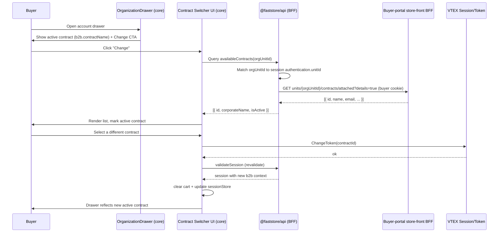

# Contract Switcher

> **Status**: Approved
> **Created**: 2026-06-04

> **References**
> - PRD: Phase 2 — Contract Switching and Selection (REQ-03 to REQ-06)
> - RFC: [FrontEnd - FastStore] Contract Switcher
> - Figma: [B2B · Multi-contract Organizations, node 103-5434](https://www.figma.com/design/I29WnCgD55t0mlAxtWPGzO/B2B-%C2%B7-Multi-contract-Organizations?node-id=103-5434&m=dev)

## 1. Business Context

### Problem Statement

A B2B buyer can belong to an Organization Unit (Org Unit) that has **multiple commercial contracts** (e.g. different corporate agreements, price tables, payment terms). Today the FastStore storefront only ever reflects a **single active contract** — `validateSession` resolves one `b2b.contractName` and there is no way for the buyer to see or change which contract they are operating under.

This forces merchants to duplicate users or Org Units to support buyers who legitimately purchase under more than one agreement, and it creates the risk of a buyer unknowingly purchasing under the wrong contract.

The contract context must be set **inside FastStore**, before the buyer enters the Organization Account application, because every downstream action (browsing, pricing, cart, checkout, Org Account) must run under the selected commercial context.

**Who is affected:** B2B buyers (operate under the right agreement) and B2B merchants (keep contract access governed without user/Org-Unit duplication).

### Goals

Deliver **Phase 2 — Contract Switching and Selection**: buyers and merchants can intentionally operate under different contracts within the same Org Unit, without duplicating users or Org Units.

- A buyer can change the active contract among those associated with their Org Unit.
- The active contract is unambiguously visible before any action is taken.
- A switch is a **full change of commercial context** — all subsequent actions execute under the new contract.
- Contract access stays governed: only the Org Unit's contracts are selectable.

### User Stories

#### US-1 (REQ-03): Change the active contract

- **Story**: As a B2B buyer, I want to change the active contract within my Org Unit, so that I can purchase under a different commercial agreement when multiple contracts are available.
- **Acceptance Criteria**:
  - **Given** a buyer whose Org Unit has 2+ contracts, **when** they open the switcher and select a different contract, **then** the switch is applied and the newly selected contract becomes the active commercial context.
  - **Given** a successful switch, **when** the buyer returns to the drawer/storefront, **then** the active contract reflects the new selection.

#### US-2 (REQ-04): Understand which contract is active

- **Story**: As a B2B buyer, I want to clearly understand which contract is currently active before performing actions, so that I do not operate under the wrong agreement.
- **Acceptance Criteria**:
  - **Given** the account drawer is open, **when** the buyer views it, **then** the currently active contract is shown by human-readable corporate name.
  - **Given** the switcher list is open, **when** the buyer scans the options, **then** the active contract is visually marked as selected/current.

#### US-3 (REQ-05): Governed contract access

- **Story**: As a B2B merchant, I want buyers to switch contracts only among those already associated with their Org Unit, so that contract access stays governed.
- **Acceptance Criteria**:
  - **Given** a buyer in an Org Unit, **when** the switcher loads, **then** only contracts associated with that Org Unit are listed and selectable.
  - **Given** a contract not associated with the Org Unit, **when** the list renders, **then** it never appears as an option.

#### US-4 (REQ-06): Full change of commercial context

- **Story**: As a B2B merchant, I want a contract switch to be a full change of commercial context, so that all subsequent buyer actions execute under the newly selected contract.
- **Acceptance Criteria**:
  - **Given** a buyer selects a new contract, **when** the switch succeeds, **then** the session is updated (`ChangeToken` followed by session revalidation) and downstream calls (PLP/PDP pricing, cart, checkout, Org Account) run under the new contract.
  - **Given** the context changed, **when** there is an in-flight cart, **then** the cart is cleared/reset so the buyer starts a clean commercial context under the new contract.

### Key Scenarios

| Scenario | Pre-conditions | Steps | Expected Result |
|---|---|---|---|
| Switch contract (happy path) | Buyer with 2+ contracts, drawer open | Click **Change** → list opens → select another contract → confirm | `ChangeToken` returns true → persisted state cleared → page reload → session revalidation; active contract updates; next action runs under the new contract |
| Active contract visibility | Drawer open | View drawer header and switcher list | Active contract shown by corporate name in the header and marked as current in the list |
| Governance | Buyer in an Org Unit with N contracts | Open switcher | Only the Org Unit's contracts appear; no others are selectable |
| Single / no alternative contract | Buyer's Org Unit has exactly one (or zero alternative) contract | Open switcher | Empty/disabled state shown ("no other contracts available"); **Change** CTA is hidden or disabled |
| Loading | Slow scopes/MasterData responses | Open switcher | Loading state shown until the list resolves |
| Error on load | Scopes or MasterData call fails | Open switcher | Error state with retry; no partial/garbled list |
| Error on switch | `ChangeToken` or revalidation fails | Select a contract | Error message shown; the **previous** contract stays active; no partial context change |
| Name resolution | Scopes returns only contract IDs | Open switcher | Each contract is displayed by its corporate name, never a raw ID |
| Context propagation | Switch just succeeded | Open Organization Account / start a purchase | The downstream action reflects the new contract |

### Functional Requirements

- **FR-1** A **Change** CTA is rendered next to the active contract in the FastStore account drawer (Org Unit / contract area, Figma node 103-5434).
- **FR-2** Activating the CTA opens a switcher that lists **only** the contracts associated with the buyer's Org Unit.
- **FR-3** Each contract is displayed by its **human-readable corporate name** (not a raw ID).
- **FR-4** The currently active contract is clearly indicated in the list.
- **FR-5** Selecting a contract applies the change when `ChangeToken` confirms a context change: persisted state is cleared, the page reloads, and session revalidation runs so the active contract reflects the new selection.
- **FR-6** On a successful switch the in-flight cart is cleared/reset.
- **FR-7** Loading, empty (single/no alternative), and error states are handled for both list load and switch apply.
- **FR-8** On switch failure, the previous contract remains active and the user is informed.
- **FR-9** The feature works on supported breakpoints (desktop/mobile) per Figma.

### Non-Functional Requirements

- **Governance/Security**: the available-contracts list is derived from the buyer's own Org Unit; private VTEX routes are reached only through the `@faststore/api` BFF using the buyer's forwarded auth cookie (`withAutCookie`) — never exposing app keys to the client. Changes here touch authentication/session and require the human-approval note per the repo's Security & Data Handling rules.
- **Performance**: the switcher fetches data on demand (when opened), not on initial page load, to protect TTFB/Core Web Vitals. Contract names are resolved in a single store-front BFF call.
- **Accessibility**: the switcher is keyboard-navigable, the active contract is conveyed non-visually (e.g. `aria-current`/selected state), and loading/error/empty states are announced.
- **Resilience**: list-load and switch-apply failures are isolated — a failed name lookup for one contract must not break the whole list.

### Out of Scope

- Contract creation / association management (governed by the merchant elsewhere).
- Switching contracts **inside** the Organization Account application (separate task, if applicable).
- Backend changes to Scopes / MasterData / Experience APIs beyond **consuming** them.
- Multi-Org-Unit switching (this feature switches contracts **within** a single Org Unit).

---

## 2. Arch Decisions

### Proposed Solution

Extend the existing B2B account drawer (`OrganizationDrawer`) with a **Contract Switcher sub-view**. The drawer header gains a **Change** CTA that toggles the drawer into a list view of the Org Unit's contracts. Selecting a contract calls a new switch flow that performs `ChangeToken` + session revalidation, clears the cart, and returns to the drawer reflecting the new active contract.

Data is served by `@faststore/api` (the BFF). The contract **list**, `corporateName`, and `isActive` are read directly from the VTEX session (`shopper.availableContracts`, with `isActive` resolved from `shopper.activeContractId` → `authentication.customerId` → `profile.id`) — no extra network call is needed for the list itself. Only the **default** flag is resolved from the buyer-portal store-front BFF (same path as `faststore-plugin-buyer-portal`):

- `commerce.storeFront.attachedContracts(orgUnitId)` → `GET /_v/store-front/units/{orgUnitId}/contracts/attached?details=true`, authenticated with the buyer's forwarded cookie (`withCookie`).

A new GraphQL query exposes the resolved list to the storefront; a new switch operation performs the context change. No new client-side secret handling is introduced. Requires the `buyer-portal-graphql` IO app in the VTEX account (for the default-contract lookup).

### Architecture Overview


```mermaid
sequenceDiagram
    participant U as Buyer
    participant D as OrganizationDrawer (core)
    participant S as Contract Switcher UI (core)
    participant G as @faststore/api (BFF)
    participant BP as Buyer-portal store-front BFF
    participant VS as VTEX Session/Token

    U->>D: Open account drawer
    D->>U: Show active contract (b2b.contractName) + Change CTA
    U->>S: Click "Change"
    S->>G: Query availableContracts(orgUnitId)
    G->>G: Match orgUnitId to session authentication.unitId
    G->>BP: GET units/{orgUnitId}/contracts/attached?details=true (buyer cookie)
    BP-->>G: [{ id, name, email, ... }]
    G-->>S: [{ id, corporateName, isActive }]
    S->>U: Render list, mark active contract
    U->>S: Select a different contract
    S->>VS: ChangeToken(contractId)
    VS-->>S: ok
    S->>G: validateSession (revalidate)
    G-->>S: session with new b2b context
    S->>S: clear cart + update sessionStore
    S->>U: Drawer reflects new active contract
```

### Alternatives Considered

| Alternative | Pros | Cons | Verdict |
|---|---|---|---|
| **Buyer-portal store-front BFF via FastStore BFF (chosen)** | Single call with names; buyer cookie only; same path as plugin; no FS_DISCOVERY app key | Requires `buyer-portal-graphql` IO app in the account | **Accepted** — validated in `b2bfaststoredev` |
| Scopes + MasterData via BFF | No IO app dependency | App key needs `View_Organization_Unit`; two-step fetch; 401/403 in dev | Rejected — blocked on app credentials |
| Experience APIs (single source returning names) | One call, no name-resolution step; aligns with future vision | Not confirmed available at implementation time; would block delivery | Rejected for now; revisit once available |
| Resolve contracts client-side directly against private routes | — | FastStore cannot natively authenticate to private routes from the browser; leaks credentials | Rejected |
| Embed full contract list in `validateSession` | Reuses existing session flow | Bloats every session validation with B2B-only data; performance cost on all users | Rejected — fetch on demand instead |

### Risks & Mitigations

| Risk | Impact | Likelihood | Mitigation |
|---|---|---|---|
| `switch-properties` contract changes upstream | Med | Low | Thin client `changeContractToken` isolates the call; contract validated in b2bfaststoredev (B2BTEAM-3827). |
| Extra MasterData calls for name resolution slow the list | Med | Low | Single store-front BFF call returns names inline |
| Partial failure leaves an inconsistent commercial context | High | Low | Treat switch as atomic: only update `sessionStore`/clear cart **after** `ChangeToken` + revalidation succeed; on failure keep previous contract |
| In-flight cart priced under the old contract | High | Med | Clear/reset cart on successful switch (Decision 3) |
| Touching session/auth without approval | Med | Low | Flag auth/session impact in the PR description per repo Security rules |

### Key Decisions

#### Decision 1: Data source = buyer-portal store-front BFF (`contracts/attached?details=true`)

- **Status**: Accepted (supersedes Scopes + MasterData)
- **Context**: Listing contracts requires org-unit scope reads that buyer tokens cannot perform directly (`View_Organization_Unit`). The buyer-portal IO app exposes `/_v/store-front/units/{orgUnitId}/contracts/attached?details=true`, returning attached `contractIds` with human-readable summaries — the same endpoint used by `faststore-plugin-buyer-portal`.
- **Decision**: Implement `availableContracts` by reading the contract **list** and `corporateName`/`isActive` directly from the VTEX session (`shopper.availableContracts` via `parseSessionAvailableContracts`; `isActive` resolved from `shopper.activeContractId` → `authentication.customerId` → `profile.id`, in that priority order). Only the **default** flag is resolved separately, via `clients.commerce.storeFront.attachedContracts(orgUnitId)` (`GET .../contracts/attached?details=true`, buyer cookie forwarded), taking the explicit `isDefault` flag when present or the first attached contract otherwise. Keep the resolver as a single boundary so either source can be swapped later without changing the storefront contract. On BFF failure, degrade to `isDefault: false` on all contracts and log a warning; the list itself never depends on the BFF call.
- **Consequences**: One HTTP call per list load; no `FS_DISCOVERY_APP_KEY` required for listing. Requires `buyer-portal-graphql` installed in the VTEX account. Default flag is never a blocker — list renders even if the BFF call fails.

#### Decision 2: `ChangeToken` + session revalidation as the switch mechanism

- **Status**: Accepted
- **Context**: The PRD/RFC require that a switch be a full change of commercial context via `ChangeToken` followed by session revalidation. The switch flow must guarantee that all downstream calls (pricing, cart, checkout, Org Account) run under the new contract token immediately after a successful switch.
- **Decision**: The switch operation consists of three steps executed in order: (1) call `changeContractToken(contractId)` which returns `true` only when the VTEX B2B session endpoint confirms the token changed, (2) call `clearPersistedSessionState()` to delete IndexedDB keys (`fs::session`, `fs::cart`) and expire the checkout orderForm cookie, and (3) perform `window.location.reload()` so the hard page load re-runs `validateSession` and `validateCart` under the new auth cookie. On failure, `changeContractToken` returns `false`, switch is aborted, and the cart and session remain untouched.
- **Consequences**: A hard reload ensures session/cart revalidation happens cleanly under the new commercial context. The flow is fully defined and shipped; endpoint integration tested in b2bfaststoredev (B2BTEAM-3827).

#### Decision 3: Clear the cart on a successful switch

- **Status**: Accepted
- **Context**: A switch is a full change of commercial context; an in-flight cart was priced/validated under the previous contract and its client profile data no longer matches the new auth cookie.
- **Decision**: On a successful switch, delete the persisted cart store (`fs::cart` from IndexedDB) and expire the checkout orderForm cookie (`checkout.vtex.com`) for all domain/path variants before the page reload. This ensures that `validateCart` creates a fresh orderForm under the new contract instead of reusing the stale one. The subsequent page reload then re-runs `validateCart` with the new auth cookie, creating a clean cart context.
- **Consequences**: Predictable pricing and context under the new contract; the buyer loses an in-progress cart on switch (acceptable given the "full change of context" requirement). Cart clearing is atomic with the token change.

#### Decision 4: UI is a sub-view inside the existing `OrganizationDrawer`

- **Status**: Accepted
- **Context**: Figma node 103-5434 shows the switcher reachable from the account drawer header.
- **Decision**: Add the **Change** CTA to `OrganizationDrawerHeader` and render the switcher as a sub-view/state of `OrganizationDrawer` (toggle between "menu" and "switch contract"), rather than a separate modal. Reuse existing FastStore/`@faststore/ui` primitives.
- **Consequences**: Consistent with current drawer UX and styling; keeps the active-contract indicator and switch list in one place.

#### Decision 5: Governed contract IDs = `contractIds` scope only (Suma BFF alignment)

- **Status**: Accepted
- **Context**: Org Unit scopes include multiple kinds (`contractIds`, `priceIds`, `collectionIds`, etc.). Only `contractIds` entries are commercial contracts eligible for switching.
- **Decision**: The `availableContracts` resolver reads `shopper.availableContracts` from the VTEX session, which the session derives from the unit's `contractIds` scope. Only entries with a non-empty `contractName` and `isActive: true` are surfaced to the switcher (aligned with Suma BFF `contracts/attached` validation).
- **Consequences**: No price-table or other scope IDs surface as fake contracts; list semantics match the buyer-portal BFF.

#### Decision 6: Navbar account area gating until session validation completes

- **Status**: Accepted
- **Context**: A B2B buyer whose session has not yet been validated on initial page load should never see "Sign in" in the account area (Design QA, 2026-08-26). The `isSessionReady` check alone is insufficient since that value is pre-seeded from sessionStorage and may reflect a cached state.
- **Decision**: Render the account area skeleton until both `isSessionReady` (session is pre-seeded or available from storage) AND `hasValidated` (at least one validation cycle has completed on this page load) are true. This is checked via `isSignInAreaResolved({ isSessionReady, hasValidated })`.
- **Consequences**: B2B buyers always see a loading state on first page load until the session is actively validated, never a flashing "Sign in" that switches to their contract name (B2BTEAM-3827).

#### Decision 7: Active contract displayed in navigation and My Account menu

- **Status**: Accepted
- **Context**: A B2B buyer must see which contract is currently active before taking action (REQ-04). The contract name should be visible in the account button and the menu area.
- **Decision**: The `OrganizationSignInButton` label uses `b2b.contractName` (the active contract's name) with a fallback to CMS-provided company/contract labels. In the My Account menu, when `b2b.unitId` exists (B2B buyer), a "Switch" button is rendered that opens the `OrganizationDrawer` in the `'switch'` view, allowing the buyer to change the active contract.
- **Consequences**: The active contract name is always visible in the navbar account button; B2B buyers can quickly access the contract switcher from the My Account menu (B2BTEAM-3827).

### Implementation Plan

1. **BFF data layer** — add a GraphQL query that returns the Org Unit's contracts (`id`, `corporateName`, `isActive`, `isDefault`), resolved from the VTEX session (`shopper.availableContracts`) with the default flag backed by `commerce.storeFront.attachedContracts`. Run codegen (`@faststore/api` then `@faststore/core`).
2. **Switch operation** — `changeContractToken` client against the VTEX `switch-properties` endpoint + `useSwitchContract` flow (shipped).
3. **SDK hook** — `useAvailableContracts()` (list) and a `switchContract()` action wiring `ChangeToken` → revalidate → cart clear → `sessionStore` update.
4. **UI** — add the **Change** CTA to `OrganizationDrawerHeader`; build the switcher sub-view (list, active indicator, loading/empty/error states) per Figma, desktop + mobile.
5. **Governance + states** — ensure only Org Unit contracts are listed; implement single/no-alternative empty state; error handling on load and switch.
6. **Tests** — unit/integration for happy path, governance, name resolution, and all error/empty states.
7. **QA** — validate in a B2B-enabled store; document the data-source decision and any `ChangeToken` findings.

---

## 3. Technical Contract

### Data Models

```ts
// GraphQL type: StoreContract
interface AvailableContract {
  id: string            // contract ID from the Org Unit contractIds scope
  corporateName: string // human-readable name (from MasterData CL)
  isActive: boolean     // true if this is the currently active contract
  isDefault: boolean    // true if this is the Organization Unit's default contract
}
```

Source mapping:
- `id` ← VTEX session `shopper.availableContracts[].customerId`
- `corporateName` ← VTEX session `shopper.availableContracts[].contractName`; contract skipped when `contractName` is empty or `isActive` is `false`
- `isActive` ← `shopper.activeContractId`, else `authentication.customerId`, else `profile.id` (whichever resolves first); falls back to the session's per-contract `isCurrent` flag when none of those resolve — same mapping as `validateSession` / `accountProfile`
- `isDefault` ← store-front BFF `contracts[].isDefault` (`GET /_v/store-front/units/{orgUnitId}/contracts/attached?details=true`, explicit flag) or the first attached contract if no flag is present (Decision 1); degrades to `false` on lookup failure

### Interfaces

**New GraphQL query (`@faststore/api`)** — exposes the governed list:

```graphql
type StoreContract {
  id: ID!
  corporateName: String!
  isActive: Boolean!
  isDefault: Boolean!
}

extend type Query {
  """
  Lists the contracts associated with the given Organization Unit,
  resolved to human-readable corporate names. Governed: only the
  authenticated buyer's Org Unit contractIds scope is used.
  """
  availableContracts(orgUnitId: String!): [StoreContract!]!
    @auth
    @cacheControl(scope: "private")
}
```

**Switch flow (storefront SDK, `@faststore/core/src/sdk/account`)**:

```ts
function useAvailableContracts(enabled: boolean): {
  contracts: AvailableContract[]
  loading: boolean
  error?: Error
}

function useSwitchContract(): {
  switchContract(contractId: string): Promise<boolean>
  loading: boolean
  error: Error | null
  enabled: boolean // false until ChangeToken is wired
}

// changeContractToken(contractId) -> boolean
// Returns true only when the server confirms the commercial context changed (via switch-properties).
// On failure, returns false; switchContract aborts and persisted state/session remain untouched.
// Steps on success: changeContractToken -> clearPersistedSessionState (IndexedDB + cookies) -> window.location.reload()
```

**UI**:
- `OrganizationDrawerHeader` gains an optional **Change** CTA (visible only when `b2b` present and the Org Unit has 2+ contracts).
- `OrganizationDrawer` gains a view state toggle (`'menu' | 'switch'`) and renders the switcher sub-view.

### Integration Points

- **Buyer-portal store-front BFF** (requires `buyer-portal-graphql` IO app): `GET https://{account}.myvtex.com/_v/store-front/units/{orgUnitId}/contracts/attached?details=true` via `clients.commerce.storeFront.attachedContracts(orgUnitId)`, authenticated with the buyer cookie (`withCookie`). Used only to resolve the unit's **default** contract; the contract list itself is read from the VTEX session. Mirrors `faststore-plugin-buyer-portal` `ContractsClient.listAttachedContracts`.
- **VTEX MasterData (CL data entity)**: `GET /api/dataentities/CL/documents/{contractId}` via `clients.commerce.masterData.getContractById`, authenticated with the buyer cookie — used by `validateSession` / `accountProfile` for the active contract name, not for the switcher list.
- **VTEX `ChangeToken`** (switch-properties endpoint): `POST` to switch the active contract token within the Org Unit; implemented via `changeContractToken(contractId)` and the auth cookie update returned in the response.
- **FastStore session**: `validateSession` GraphQL mutation + `sessionStore` (`packages/core/src/sdk/session/index.ts`); `b2b` shape in `StoreSession`/`StoreB2B` (`packages/api/src/platforms/vtex/typeDefs/session.graphql`).
- **Cart**: `cartStore` (`packages/core/src/sdk/cart`) — cleared on a successful switch; already revalidates on `sessionStore.set`.

### Invariants & Constraints

- The switcher MUST only ever list contract IDs from the Org Unit's `contractIds` scope (governance; REQ-05; Suma BFF alignment).
- Contracts MUST be displayed by `corporateName`; a raw ID MUST NOT be shown to the user. Contracts without both `name` and `email` in the store-front BFF response MUST NOT appear in the list.
- A switch MUST be atomic: the session (auth token) and cart change **only** after `changeContractToken` returns `true`; persisted client state (`fs::session`, `fs::cart` IndexedDB keys, checkout orderForm cookie) is cleared before the hard reload; on any failure the previous contract remains active and the cart is untouched.
- The currently active contract MUST be identifiable before any action is taken (REQ-04); the account area MUST NOT render "Sign in" for a B2B buyer until `hasValidated` is true.
- The default contract (when present) MUST be visually distinct (star icon) in the switcher list (current-session card and the options list).
  - The default indicator (blue star, `aria-label="Default contract"`) is shown in the drawer header next to **Change** when the active contract is the unit default; the list is fetched when the drawer opens (`useAvailableContracts(isOpen && hasUnit)`), never on page load.
- Private VTEX routes MUST be reached only through the BFF; no app keys or private-route credentials may reach the browser.
- Data MUST be fetched on demand (drawer open), not during initial page render, to protect performance budgets.
- `@generated` / `__generated__` artifacts MUST be produced via codegen, not hand-edited.
