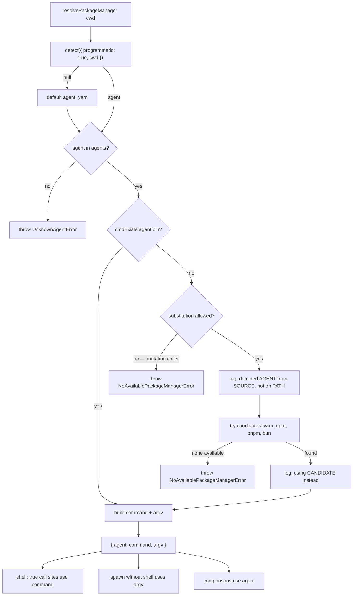

# Safe Package Manager Resolution

> **Status**: Approved
> **Created**: 2026-07-29

> **References**
> - Incident: FastStore WebOps build failure on store account `cmsdev` — `/bin/sh: syntax error: unexpected "("`, exit code 2, during `yarn build` → `faststore build`
> - Upstream: `@antfu/ni@0.21.12` — `detect()` interactive fallback, `run()` `DEBUG_SIGN`, `getVoltaPrefix()`
> - Related infra: `dk-cicd-hub` → `dk_hub/dockerfiles/nextjs.Dockerfile` (the `builder` stage does not carry the package manager installed in `deps`)
> - Affected call sites: `packages/cli/src/utils/commands.ts:10`, `commands/build.ts:55`, `commands/dev.ts:64`, `commands/start.ts:30`, `commands/test.ts:33`, `commands/generate-graphql.ts:33`, `utils/dependencies.ts:15`

## 1. Business Context

### Problem Statement

`getPreferredPackageManager()` resolves which package manager the CLI should use by spawning the `na` binary from `@antfu/ni` with the argument `?`, and returning its **raw stdout** with no validation:

```ts
// packages/cli/src/utils/commands.ts:10-22
agent = spawnSync('node', [binNA, '?'], { encoding: 'utf-8' })?.stdout.trim()
return agent
```

The returned string is then interpolated straight into a shell command by every caller — for example `spawnSync(`${packageManager} run build`, { shell: true, … })` in `build.ts`.

`ni` is being invoked in **non-programmatic** mode. In that mode, when `detect()` resolves an agent whose binary is not on `PATH`, it does not fail — it renders an **interactive prompt to `process.stdout`**:

- `terminalLink(agent, INSTALL_PAGE[agent])` has no hyperlink support in a non-TTY, so it falls back to `` `${text} (${url})` `` — e.g. `pnpm (https://pnpm.io/installation)`.
- The `confirm` prompt renders its `(y/N)` option, and `prompts` writes the rendered frame to `process.stdout`.

Both contain `(`. That text becomes the value of `packageManager`, producing a command string the shell cannot parse:

```
sh -c "Would you like to globally install pnpm (https://…)? › (y/N) run build"
  → /bin/sh: syntax error: unexpected "("   (exit 2)
```

The diagnostic that would have explained the problem — `[ni] Detected pnpm but it doesn't seem to be installed.` — is written to **stderr**, which the CLI discards because `spawnSync` pipes it. The operator only sees a shell syntax error with no relation to its cause.

**How the incident was reached.** The store had both `pnpm-lock.yaml` and `yarn.lock` committed, and two components disagreed on precedence:

| Component | Precedence order | Chose |
|---|---|---|
| `nextjs.Dockerfile` install chain | `yarn.lock`, `package-lock.json`, `pnpm-lock.yaml` | **yarn** — so `deps` installed with yarn and `pnpm` was never installed |
| `ni` `LOCKS` | `bun.lockb`, `pnpm-lock.yaml`, `yarn.lock`, `package-lock.json` | **pnpm** — not present in the `builder` stage |

Removing `pnpm-lock.yaml` from the store made the build pass, which confirms the detection came from the lockfile and not from a `packageManager` field (that field takes precedence inside `detect()`).

**Who is affected:** store maintainers whose repository detects an agent unavailable in the build image (typically two committed lockfiles, or a genuinely pnpm/bun store built by the WebOps image), and anyone debugging such a build — the failure is unattributable from the log. Local `faststore dev` / `start` / `test` are affected by the same path.

### Goals

Make package-manager resolution **safe by construction** and **self-explanatory when it cannot be satisfied**, without changing the outcome of any build that works today.

**Branches in scope**: both `dev` (full change) and `origin/3.x` (widened fallback guard only, per Decision 5). Both are deliverables — the 3.x branch is where the observed incident happened, and no pipeline-side mitigation is planned, so 3.x stores are only reached by the backport.

- An unvalidated string can never reach a shell command built by the CLI.
- When the detected agent is unavailable, the log states which agent was detected, where the detection came from, and what the CLI did about it.
- `ni` is never allowed to open an interactive prompt from inside the CLI.
- Callers that need an agent identity (for comparisons) and callers that need an executable command are served by distinct, unambiguous values.

### User Stories

#### US-1: Understandable failure

- **Story**: As a store maintainer whose build fails, I want the log to name the package manager the CLI resolved and why it could not use it, so that I can act without reverse-engineering a shell error.
- **Acceptance Criteria**:
  - **Given** a repository where `ni` detects an agent absent from `PATH`, **when** `faststore build` runs, **then** the log contains the detected agent, the detection source (`packageManager` field or lockfile name), and the agent actually used.
  - **Given** the same repository, **when** the build proceeds, **then** no message emitted by the CLI contains an interactive prompt fragment such as `(y/N)`.

#### US-2: No regression for builds that work today

- **Story**: As a store maintainer whose build works today, I want this change to be invisible, so that a diagnostics improvement cannot break my pipeline.
- **Acceptance Criteria**:
  - **Given** a repository whose detected agent is installed, **when** any CLI command resolves the package manager, **then** the executed command is byte-identical to the one executed before this change, including the `volta run` prefix when Volta is present.
  - **Given** a repository with no lockfile and no `packageManager` field, **when** resolution runs, **then** the CLI uses its documented default rather than an agent chosen by `ni`'s interactive config.

#### US-3: No unvalidated text in a shell command

- **Story**: As a CLI maintainer, I want resolution to return a value drawn from a closed set, so that arbitrary text can never be interpolated into `spawnSync(…, { shell: true })`.
- **Acceptance Criteria**:
  - **Given** any resolution outcome, **when** the value is produced, **then** its agent identity is a member of `ni`'s `agents` list.
  - **Given** a resolution path that cannot produce a member of that set, **when** it is reached, **then** the CLI throws with an explicit message instead of returning the value.

### Key Scenarios

| # | Type | Pre-conditions | Steps | Expected result |
|---|---|---|---|---|
| 1 | Happy path | `yarn.lock` only; `yarn` on `PATH` | `faststore build` | Resolves `yarn`; runs `yarn run build` in `.faststore`; no new log lines |
| 2 | Happy path (Volta) | `yarn.lock` only; `volta` and `yarn` on `PATH` | `faststore build` | Shell command is `volta run yarn run build`; `spawn` without shell uses argv `['volta','run','yarn']` |
| 3 | Error → the incident | `pnpm-lock.yaml` + `yarn.lock`; only `yarn` on `PATH` | `faststore build` | Logs that `pnpm` was detected from `pnpm-lock.yaml` and is not installed, and that `yarn` is used instead; build proceeds; no shell syntax error |
| 4 | Error | `pnpm-lock.yaml` only; neither `pnpm` nor `yarn` on `PATH`; `npm` present | `faststore build` | Logs the detection and the substitution; the build resolves and runs with `npm`. If the generate step needs to install missing feature dependencies, it throws the named error instead of writing a `package-lock.json` next to `pnpm-lock.yaml` |
| 5 | Error | No usable agent on `PATH` at all | `faststore build` | Throws a named error listing the detected agent and the candidates tried; never emits a partial shell command |
| 6 | Edge | No lockfile, no `packageManager` field | `faststore build` | Resolves the documented default (`yarn` when available) deterministically; `ni`'s `defaultAgent: 'prompt'` never surfaces |
| 7 | Edge | `package.json` has `packageManager` naming an agent `ni` does not know | `faststore build` | Falls through to lockfile detection as `ni` already does; the unknown value is reported once, and never used as a command |
| 8 | Edge | `@antfu/ni` cannot be resolved from the CLI's install tree | any command | Falls back to the documented default with an explicit log line, matching today's early-return behaviour |

### Functional Requirements

- **FR-1**: Resolution MUST use `@antfu/ni`'s library API with `programmatic: true`, not the `na` binary. The binary exposes no way to disable the interactive fallback.
- **FR-2**: Resolution MUST validate the resolved agent against `ni`'s `agents` list before the value is used to build any command.
- **FR-3**: When the resolved agent's binary is not on `PATH`, resolution MUST log an explicit diagnostic and substitute the first available candidate, rather than failing. Substitution is reserved for call sites that only *run* commands: a caller whose operation writes to the project (dependency installation) MUST resolve with substitution disabled, and resolution MUST then throw instead — installing with a substitute agent would write a second, conflicting lockfile.
- **FR-4**: When no candidate is available, resolution MUST throw a named error. It MUST NOT return a partially-formed or empty command.
- **FR-5**: Resolution MUST return the agent identity and the executable form as separate values, so callers stop pattern-matching a command string.
- **FR-6**: The `volta run` prefix MUST be preserved in the executable form, and MUST NOT leak into the agent identity.
- **FR-7**: Every existing call site MUST consume the value appropriate to how it spawns: the shell string for `shell: true`, the argv array for `spawn` without a shell, the agent identity for comparisons.

### Non-Functional Requirements

- **NFR-1**: No new runtime dependency. `@antfu/ni` is already a `dependencies` entry of `@faststore/cli`, pinned at `0.21.12` via `pnpm-workspace.yaml` `catalog:`.
- **NFR-2**: Resolution MUST NOT read from stdin or write an interactive prompt to stdout under any code path.
- **NFR-3**: Replacing the child-process spawn with an in-process call MUST NOT increase CLI startup cost; it removes one Node process per resolution.
- **NFR-4**: `packages/cli/src/utils/commands.test.ts` MUST cover FR-2 through FR-6, following the existing `src/utils/*.test.ts` Vitest pattern.
- **NFR-5**: Log messages MUST NOT include secrets, tokens, or `.env` values. Only the agent name, the detection source, and the substitution are reported.

### Out of Scope

The following were considered and deliberately excluded. All of them are pipeline-side: they would reach the whole store fleet on the next deploy, whereas this spec reaches each store only when it upgrades the CLI. That slower rollout is an **accepted trade-off** — there are no open reports of this failure beyond the one incident, which the store resolved by removing the redundant lockfile.

- **Making the build image tolerant** (installing every package manager `ni` might detect into the `builder` stage of `nextjs.Dockerfile`). Would stop the crash fleet-wide and immediately, but a store with two lockfiles would then build with one manager over a tree installed by another — silently. This spec substitutes toward the manager that actually installed, and says so in the log.
- **Pre-build validation in the Tekton task** (flagging multiple lockfiles or a `packageManager` field inconsistent with the chosen lockfile). Would make the inconsistency legible fleet-wide, but as a warning it does not prevent the failure on an unpatched CLI, and as a hard failure it would break stores that build correctly today.
- **Changing which package manager a store installs with, or the lockfile precedence in `nextjs.Dockerfile`.** Would alter the production dependency tree of stores that build correctly today — unacceptable risk for a diagnostics fix.
- **Removing `shell: true` from the six call sites** in favour of argv arrays everywhere. FR-5 and FR-7 remove the injection surface at the source; converting every spawn is a larger refactor with no additional safety once the value set is closed.
- **Detecting or reporting multiple committed lockfiles as a store-level lint.** Worth doing, but it belongs to store scaffolding, not to command resolution.
- **Changing `@antfu/ni`'s version or replacing it with `package-manager-detector`.**

---

## 2. Arch Decisions

### Proposed Solution

Replace the "spawn `na ?` and trust stdout" strategy with an in-process resolution built on `@antfu/ni`'s public API, returning a validated, structured value.

`resolvePackageManager()` becomes the single resolution point:

1. `detect({ programmatic: true, cwd })` — `programmatic: true` disables both the install prompt and the `defaultAgent: 'prompt'` path, so `ni` can only return an agent or `null`.
2. If `detect()` returns `null`, use the CLI's documented default (`yarn`).
3. Validate the agent against `agents`. A non-member throws — it can only come from a version skew in `ni`.
4. `cmdExists(bin)` on the resolved agent. If missing, log the detected agent, the detection source, and the substitution, then walk a deterministic candidate list (`yarn`, then `npm`). If none is available, throw.
5. Build the executable forms once: `command` for `shell: true` call sites, `argv` for `spawn` without a shell. `getVoltaPrefix()` is applied to both and never to `agent`.

`getPreferredPackageManager()` is kept as a thin wrapper returning `command`, so the change lands without touching all six call sites at once; the two call sites that misuse the value today are corrected to read `agent` and `argv`.

### Architecture Overview



### Alternatives Considered

| Alternative | Pros | Cons | Verdict |
|---|---|---|---|
| **ni library API + validation + substitution (chosen)** | Removes the prompt path entirely; closed value set; zero regression; no new dependency; one fewer process spawn | Slightly more code than the current four lines | **Accepted** |
| Keep spawning `na ?`, sanitise stdout | Smallest diff | Treats the symptom. The prompt path stays reachable, and any future `ni` stdout change re-opens the class. `programmatic` cannot be passed to the binary at all | Rejected |
| Fail fast when the agent is not on `PATH` | Cleanest message; stops before `generate`/`cache-graphql` waste time | `cmdExists` is `which.sync`, which can miss a command a shell would still resolve; would convert some working builds into failures — the exact risk this spec is meant to avoid | Rejected as the default; recorded in Decision 3 |
| Pin the agent through an env var or CLI flag | Fully deterministic; pipeline decides once | Adds surface to every caller and to the pipeline; does not fix the unvalidated-string path on its own | Rejected for now; compatible follow-up if WebOps later wants to pin explicitly |
| Align `nextjs.Dockerfile` precedence with `ni` instead of changing the CLI | Fixes the disagreement at its root | Would switch stores like the incident's to install from `pnpm-lock.yaml`, changing their production dependency tree. Unacceptable risk for a diagnostics fix | Rejected |

### Risks & Mitigations

| Risk | Impact | Likelihood | Mitigation |
|---|---|---|---|
| `cmdExists` false negative substitutes an agent that was actually usable | Med | Low | Substitution is logged with the detected agent and the reason, so the operator can see and challenge it. Nothing throws on this path — the build proceeds |
| Substituting an agent silently hides a real lockfile inconsistency | Med | Med | The log line names the detection source (`pnpm-lock.yaml`), which is the actionable signal. Store-level linting is listed as out of scope but recommended as follow-up |
| Behaviour drift between the resolved agent and the agent that installed `node_modules` | Med | Med | Pre-existing and unchanged by this spec: the incident's build already installed with yarn and would have built with pnpm. Accepted as an open gap — closing it requires the pipeline-side work listed in Out of Scope |
| `detect({ programmatic: true })` changes the no-lockfile outcome | Low | Med | Explicitly pinned by Decision 4: the CLI's own default (`yarn`) wins over `ni`'s programmatic `npm`, preserving today's documented default |
| Callers still treating the return value as a bare binary name | Med | Low | FR-7 plus the corrections in `start.ts` and `dependencies.ts`; the structured return makes the misuse a type error rather than a runtime surprise |
| 3.x stores do not benefit | High | High | Decision 5: backport to `origin/3.x` by widening the existing fallback guard |

### Key Decisions

#### Decision 1: Resolve through `ni`'s library API, not the `na` binary

- **Status**: Accepted
- **Context**: `programmatic: true` is what disables both the install prompt and the `prompt` default agent. It is an option of `detect()` / `getCliCommand()`; the `na` CLI entry point never exposes it. As long as resolution goes through the binary, the interactive path stays reachable. `@antfu/ni@0.21.12` exports `detect`, `getCommand`, `cmdExists`, `getVoltaPrefix`, `AGENTS`, and `agents` from its package root.
- **Decision**: Call `detect({ programmatic: true, cwd })` in-process and compose the command from `getCommand(agent, 'agent')` plus `getVoltaPrefix()`. Drop the `na` spawn, and with it the `getPackageRootDir` / `getDepPackageJSON` binary-path resolution that exists only to locate it.
- **Consequences**: The prompt path becomes unreachable by construction rather than by validation. One fewer Node process per resolution. `getPackageRootDir`, `getDepPackageJSON` and their private `loadPackageJsonAt` existed only to locate the `na` binary and nothing else in `packages/` imports them, so they are removed. That leaves `resolve-pkg` unused in `@faststore/cli` (`@faststore/diagnostics` declares its own), so it is dropped from the package manifest as well.

#### Decision 2: Validate the agent against a closed set before it can reach a shell

- **Status**: Accepted
- **Context**: The defect is not the prompt; it is that any string `ni` prints becomes a shell command. Even with Decision 1, a version skew in `ni` could return something unexpected.
- **Decision**: Check the resolved agent against `ni`'s `agents` list. A non-member throws a named error naming the offending value. Callers never receive an unvalidated string.
- **Consequences**: `command` and `argv` are always derived from a member of a known set. The class of failure this spec addresses cannot recur through a different upstream change.

#### Decision 3: Unavailable agent → log and substitute, do not fail fast

- **Status**: Accepted
- **Context**: Fail-fast produces the cleaner message, but `cmdExists` is `which.sync`, which does not necessarily agree with what a shell would resolve. Throwing on a false negative would break a build that works. In the incident specifically, substituting yarn would have been *correct*: the pipeline's `BUILD_COMMAND` was already `yarn build` and `deps` had already installed with yarn — `ni` was the component that disagreed.
- **Decision**: When the resolved agent's binary is absent, log the detected agent, the detection source, and the substitution, then use the first available of `yarn`, `npm`, and then the remaining known agents (`pnpm`, `bun`) as last resorts. Throw only when no candidate is available.
- **Scope (review follow-up)**: Substitution applies only to call sites that *run* the project (`build`, `dev`, `start`, `test`, `generate-graphql`). The one mutating call site, `installDependencies`, resolves with `substitute: false` and gets a thrown error instead: running e.g. `yarn add` in a pnpm store writes a `yarn.lock` next to `pnpm-lock.yaml`, manufacturing exactly the dual-lockfile ambiguity behind the incident (and `yarn` may not understand `workspace:` ranges in a pnpm project). A deliberate, explained failure is preferable to silently corrupting the store's lockfile state.
- **Consequences**: Regression risk is zero — every path that produced a working command still produces the same one, and every path that now throws was already failing before this spec (with an unattributable shell error). The operator gets the diagnostic that was previously lost to stderr. The trade-off is that a lockfile inconsistency is reported rather than enforced on the run path; enforcement is deliberately left to store-level linting. This decision alone is sufficient for the observed incident: substituting `yarn` matches the manager that installed `node_modules`, so the build completes with no pipeline change required.
- **Alternative recorded**: fail-fast on `!cmdExists` everywhere. Cheap to switch later — it is one branch in `resolvePackageManager` — if the fleet turns out to have no false negatives and the team prefers enforcement.

#### Decision 4: Keep `yarn` as the CLI's default when detection yields nothing

- **Status**: Accepted
- **Context**: `detect()` returns `null` when there is no lockfile and no `packageManager` field. Today `getPreferredPackageManager` initialises `agent = 'yarn'` and `ni`'s non-programmatic path would reach `defaultAgent: 'prompt'`. Under `programmatic: true`, `getDefaultAgent` would return `npm` instead — a silent change of default.
- **Decision**: On `null`, the CLI uses `yarn`, matching its current documented default. `ni`'s `defaultAgent` config is not consulted.
- **Consequences**: The no-lockfile case stays deterministic and unchanged. The CLI's default is stated in one place instead of being an emergent property of `ni`'s config file.

#### Decision 5: Backport to 3.x by widening the existing guard, not by porting the new contract

- **Status**: Accepted
- **Context**: The affected store runs 3.x, and `origin/3.x` is maintained. Its resolution is `spawnSync('na', ['?'], { shell: true })` with `if (agent === '') return 'yarn'`. That guard catches empty stdout but not polluted stdout — which is exactly the incident. Note also that in 3.x this guard means a build with `CI` set in the environment already falls back to yarn and succeeds; removing it would break those.
- **Decision**: On `3.x`, widen the guard from "is empty" to "is not a member of `agents`", keeping the `yarn` fallback and adding the diagnostic log. Do not port the structured return or the library-API rewrite.
- **Consequences**: A strict superset of today's 3.x behaviour — everything that falls back still falls back, and the incident now falls back too instead of producing a shell syntax error. Minimal, reviewable diff on a maintenance branch. The full contract change lands only on `dev`.
- **Why it matters more than it looks**: because every pipeline-side intervention is out of scope, the backport is the *only* thing that reaches stores on the 3.x line. `dev` is at 4.5.0-dev, and `origin/3.x` is actively maintained, which implies stores stay on it deliberately. Without this step the fix covers 4.x stores only.

#### Decision 6: Split the return value into identity and executable forms

- **Status**: Accepted
- **Context**: The current return value is overloaded, and two call sites are already wrong because of it. `getVoltaPrefix()` can make it `volta run yarn`, but `start.ts:40` passes it as `argv[0]` to `spawn` without a shell (which would fail with `ENOENT`), and `dependencies.ts:16` compares it with `=== 'npm'` (which would silently pick `add` over `install`). `getPreferredPackageManager` is internal — `packages/cli/src/index.ts` exports only `run` and `commands` — so the shape can change without the public-signature approval the root `AGENTS.md` requires.
- **Decision**: Return `{ agent, command, argv }`. `agent` for comparisons, `command` for `shell: true`, `argv` for `spawn` without a shell. Keep `getPreferredPackageManager()` as a wrapper returning `command` so unaffected call sites are untouched.
- **Consequences**: Two latent bugs are fixed as a by-product. Future call sites are pushed toward the correct form by the type. Diff stays proportional: one new util plus two corrected call sites.

### Implementation Plan

1. **Resolution util** — add `resolvePackageManager(cwd?)` to `packages/cli/src/utils/commands.ts` implementing Decisions 1–4 and 6. Remove the `na` spawn. Keep `getPreferredPackageManager()` as a wrapper returning `command`.
2. **Tests** — add `packages/cli/src/utils/commands.test.ts` covering: detection from each lockfile; the two-lockfile precedence that caused the incident; unavailable agent → substitution plus log; no candidate → throw; non-member agent → throw; `null` detection → `yarn`; Volta prefix present in `command`/`argv` and absent from `agent`. Mock `@antfu/ni` and `PATH` lookups per the package's testing convention.
3. **Correct the misusing call sites** — `commands/start.ts` consumes `argv` for the non-shell `spawn` and `command` for the `shell: true` one; `utils/dependencies.ts` compares `agent === 'npm'`.
4. **Verify the untouched call sites** — `build.ts`, `dev.ts`, `test.ts`, `generate-graphql.ts` keep using `getPreferredPackageManager()`; confirm each still receives the shell-appropriate form.
5. **Rebuild and validate downstream** — `pnpm build` in `packages/cli` before running any downstream `generate`, per the non-negotiable build ordering in `packages/cli/AGENTS.md`.
6. **Reproduce the incident locally** — in a fixture with both `pnpm-lock.yaml` and `yarn.lock` and no `pnpm` on `PATH`, confirm `faststore build` logs the substitution and completes instead of emitting `/bin/sh: syntax error`.
7. **Backport** — open a separate PR against `origin/3.x` implementing Decision 5 only.
8. **PR description** — record the `@antfu/ni` API-surface change (binary → library, same pinned version, no new dependency) per the root `AGENTS.md` dependency-discipline checklist, and link the `dk-cicd-hub` counterpart.

---

## 3. Technical Contract

### Data Models

```ts
import type { Agent } from '@antfu/ni'

interface ResolvedPackageManager {
  /** Validated member of ni's `agents`. Use for comparisons — never for execution. */
  agent: Agent
  /** Executable form for `spawnSync(cmd, { shell: true })`. May include `volta run`. */
  command: string
  /** Executable form for `spawn(file, args)` without a shell. */
  argv: [string, ...string[]]
}
```

The returned value deliberately carries no detection-source field. Reporting "detected `pnpm` **from `pnpm-lock.yaml`**" would mean reimplementing `ni`'s precedence rules inside the CLI, which would then drift from `ni`. Instead the diagnostic lists the lockfiles actually committed, read from `ni`'s own exported `LOCKS`, without asserting which one won. That is equally actionable and cannot disagree with `ni`.

Invariant on the three forms, for `agent: 'yarn'`:

| Volta present | `agent` | `command` | `argv` |
|---|---|---|---|
| no | `'yarn'` | `'yarn'` | `['yarn']` |
| yes | `'yarn'` | `'volta run yarn'` | `['volta','run','yarn']` |

### Interfaces

```ts
// packages/cli/src/utils/commands.ts

/**
 * Resolves the package manager for `cwd` using @antfu/ni in programmatic mode.
 *
 * Never reads stdin and never writes an interactive prompt. The returned
 * `agent` is always a member of ni's `agents` list.
 *
 * `substitute: false` is for callers that write to the project: with it, a
 * detected-but-missing agent throws instead of being substituted, because
 * installing with a substitute would write a conflicting lockfile.
 *
 * @throws UnknownAgentError                 resolved agent is not a known agent
 * @throws NoAvailablePackageManagerError    neither the detected agent nor any
 *                                           candidate is available on PATH, or
 *                                           the detected agent is missing and
 *                                           `substitute` is `false`
 */
export async function resolvePackageManager(
  cwd?: string,
  options?: { substitute?: boolean }
): Promise<ResolvedPackageManager>

/**
 * Backwards-compatible wrapper returning `ResolvedPackageManager.command`.
 * Prefer `resolvePackageManager()` in new code.
 */
export async function getPreferredPackageManager(cwd?: string): Promise<string>

export class UnknownAgentError extends Error {}
export class NoAvailablePackageManagerError extends Error {}
```

Candidate order when the detected agent is unavailable: `['yarn', 'npm', 'pnpm', 'bun']`, first one satisfying `cmdExists`. `yarn` and `npm` lead because they are what the store build images ship; the remaining known agents are last resorts so an environment that only has one of them still resolves.

Diagnostic emitted on substitution, via `logger.warn`. It must be `warn` and not `log`: `logger.log` is suppressed unless `DISCOVERY_DEBUG=true`, so a `log` call would be invisible in CI, which is where this matters.

```
warning - Detected "pnpm" but it is not installed in this environment. Using "yarn" instead.
More than one lockfile is committed (pnpm-lock.yaml, yarn.lock). Keep a single one so
the package manager is unambiguous.
```

The second line appears only when more than one lockfile is present in `cwd`.

### Integration Points

- **`@antfu/ni@0.21.12`** (existing `dependencies` entry, pinned via `pnpm-workspace.yaml:6` `catalog:`). Consumed API: `detect`, `getCommand`, `cmdExists`, `getVoltaPrefix`, `agents`, and the `Agent` type. The `na` binary is no longer invoked.
- **CLI call sites**: `commands/build.ts:55`, `commands/dev.ts:64`, `commands/start.ts:30`, `commands/test.ts:33`, `commands/generate-graphql.ts:33`, `utils/dependencies.ts:15`.
- **`utils/logger.ts`** — the substitution diagnostic and the `ni`-unresolvable fallback notice.
- **`dk-cicd-hub` → `dk_hub/dockerfiles/nextjs.Dockerfile`** — the `builder` stage does not carry the package manager that `deps` installed, and its lockfile precedence differs from `ni`'s. Tracked separately; this spec makes the CLI resilient to that disagreement but does not resolve it.
- **`origin/3.x`** — receives Decision 5 only.

### Invariants & Constraints

- Resolution MUST NOT read stdin, and MUST NOT write an interactive prompt to stdout or stderr, on any path.
- `ResolvedPackageManager.agent` MUST be a member of `ni`'s `agents` list. Any other value MUST throw before the value can be used.
- `agent` MUST NOT contain a Volta prefix; `command` and `argv` MUST contain it whenever `getVoltaPrefix()` is non-empty.
- Every string the CLI interpolates into a `shell: true` command MUST derive from `command`, never from raw `ni` output.
- `spawn` calls without a shell MUST use `argv`, never `command`.
- Any resolution outcome other than a successful one MUST be either logged (substitution) or thrown (unknown agent, no candidate). Silent empty or partial values are FORBIDDEN.
- Call sites that write to the project (dependency installation) MUST resolve with `substitute: false`; substitution is reserved for call sites that only run commands.
- Diagnostics MUST name only the agent, the detection source, and the substitution. Secrets, tokens, and `.env` values MUST NOT appear.
- Behaviour for repositories whose detected agent is installed MUST be byte-identical to the pre-change behaviour, Volta prefix included.
- The 3.x backport MUST preserve the existing `yarn` fallback; widening the guard is permitted, removing it is FORBIDDEN.
