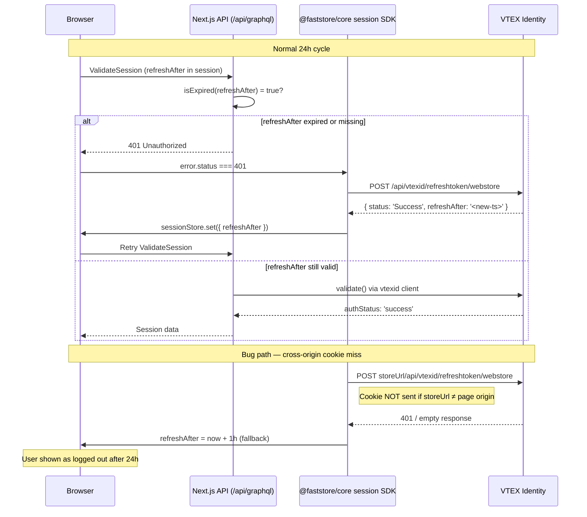

# Session Expiration After 24h Despite 7-Day Refresh Token Configuration

> **Status**: Done
> **Created**: 2026-04-07

## 1. Business Context

### Problem Statement

On stores with the `experimental.refreshToken` feature enabled (e.g. `b2bfaststoredev`), authenticated sessions expire and force re-authentication after approximately 24 hours, even when VTEX Identity is configured with a 7-day refresh token TTL.

This affects both B2B and B2C customers who expect to remain logged in for the configured refresh token duration. Re-authentication interrupts purchase flows, account management actions, and any session-sensitive operation — particularly harmful in B2B contexts where login involves organization-level credential flows.

### Goals

- Authenticated sessions persist for the full duration of the refresh token TTL configured in VTEX Identity (e.g. 7 days) without requiring re-authentication.
- Token refresh happens transparently, without user-visible interruptions.
- Session expiration (when it legitimately should occur) results in a clear redirect to login, not a looping 403 page.

### User Stories

#### US-1: Persistent session across JWT rotations

- **Story**: As a logged-in customer, I want my session to remain active as long as my refresh token is valid, so that I do not need to log in again every 24 hours.
- **Acceptance Criteria**:
  - **Given** a user logged in to a store with `experimental.refreshToken: true` and a 7-day refresh token TTL configured in VTEX Identity, **when** 24 hours pass and the access JWT (`VtexIdclientAutCookie`) expires, **then** the session is transparently renewed via the refresh token and the user remains authenticated.
  - **Given** a user navigates to `/pvt/account/*` after the JWT has expired but within the refresh token window, **when** the server-side `validateUser` detects an expired JWT, **then** the user is redirected to the 403 intermediate page, a refresh is attempted client-side, and on success they are sent back to the original page without re-authentication.
  - **Given** a user with an expired JWT AND an expired refresh token, **when** any protected page is accessed, **then** the user is redirected to `/login`.

#### US-2: Correct refreshAfter propagation

- **Story**: As the system, I want the `refreshAfter` timestamp to reflect the true VTEX Identity refresh window, so that the client triggers refreshes at the right time.
- **Acceptance Criteria**:
  - **Given** a successful call to `/api/vtexid/refreshtoken/webstore`, **when** the response contains a `refreshAfter` timestamp, **then** it is stored in the session as a Unix timestamp in seconds and correctly compared by `isExpired()` on subsequent requests.
  - **Given** a failed refresh token call, **when** the system sets `refreshAfter = now + 1h` as a fallback, **then** a retry is performed after 1 hour, and if the refresh token is still valid in VTEX Identity, the retry succeeds.

### Key Scenarios

| Scenario | Pre-conditions | Steps | Expected Result |
|---|---|---|---|
| Happy path: JWT expires, refresh succeeds | User logged in, `refreshToken: true`, `refreshAfter` set to a future timestamp, refresh token cookie valid | 24h pass; user navigates to any page | `refreshTokenRequest()` is called; new JWT issued; `refreshAfter` updated; user stays logged in |
| Error case: refresh token cookie missing | User's refresh token cookie was never set or was cleared | `refreshTokenRequest()` is called | Returns `undefined` or non-success; session is set with `refreshAfter = now + 1h`; after 1h, retry is made |
| Error case: refresh token itself expired | 7+ days since last login | User navigates to `/pvt/account` | `validateUser` returns `{ isValid: false, needsRefresh: true }`; refresh is attempted but fails; user is redirected to login |
| Edge case: session localStorage cleared | User clears browser data mid-session | User navigates to any page | `refreshAfter = null`; `tokenExistAndIsFirstRefreshTokenRequest` fires if JWT still present; OR if JWT absent, SDK-level 401 triggers refresh |
| Edge case: first page load after login | User just logged in, `refreshAfter = null` | First `ValidateSession` call | `tokenExistAndIsFirstRefreshTokenRequest = true`; 401 thrown; client-side refresh; `refreshAfter` set from VTEX response |
| Edge case: storeUrl differs from page origin | Store served via `.vtex.app` but `storeUrl` points to `*.fast.store` | `refreshTokenRequest()` called | Cookie domain mismatch; refresh fails silently; session loses auth after 24h |

### Functional Requirements

1. The session MUST remain valid for the configured refresh token TTL without user-initiated re-authentication.
2. The `refreshAfter` timestamp stored in the session MUST accurately reflect when the next token refresh is needed.
3. Token refresh MUST use the correct origin so that VTEX Identity session cookies are included (same-origin or explicit CORS with credentials).
4. When refresh fails legitimately (expired refresh token), the system MUST redirect to `/login` without looping through 403.
5. The `shouldRefreshToken` logic in `graphql.ts` MUST correctly identify when a refresh is needed without generating false positives on every new session start.

### Non-Functional Requirements

- Refresh token calls must complete within 3 seconds (3 retries are already in place).
- Session renewal must produce no user-visible flash or interruption for the happy path.
- Failures must be logged server-side for observability.

### Out of Scope

- Changes to VTEX Identity configuration (refresh token TTL, access token TTL).
- OAuth/SSO flows unrelated to `VtexIdclientAutCookie`.
- B2B-specific organization session handling (separate from the auth token itself).

---

## 2. Arch Decisions

### Proposed Solution

The investigation points to four compounding issues that collectively cause the 24-hour re-authentication:

1. **`tokenExistAndIsFirstRefreshTokenRequest` is an unreliable heuristic.** The condition `!!jwt && !refreshAfterExist` fires on every new browser tab, incognito session, or localStorage clear — not just the very first login. This can cause premature token refresh calls with a valid but un-stored `refreshAfter`.

2. **`refreshAfterExpired` silently succeeds the wrong branch when `refreshAfter` is derived from the JWT's `exp`.** If VTEX Identity's `/api/vtexid/refreshtoken/webstore` returns `refreshAfter` matching the JWT's `exp` (24h), then `refreshAfterExpired = true` always coincides with `tokenExpired = true`, causing `tokenExpiredAndRefreshAfterIsNullOrExpired = true` and triggering a new refresh. This cycle is correct — but only if the refresh TOKEN cookie is reliably present.

3. **The refresh token cookie may not be included in `refreshTokenRequest()` if `storeUrl` differs from the page's origin.** The `credentials: 'include'` flag only sends cookies for requests to the same origin. If `discoveryConfig.storeUrl` resolves to a different domain than the page the user is currently on (e.g., `*.fast.store` vs `*.vtex.app`), cookies are silently excluded by the browser's same-origin policy.

4. **Failed refreshes in the SDK's `validateSession` handler do not surface a user-visible error or redirect.** The user sees stale session data and may appear logged out with no clear action to take.

The fix involves:
- Routing `refreshTokenRequest` through the Next.js API layer (`/api/fs/...`) to avoid cross-origin cookie issues, or adding explicit CORS handling.
- Adding server-side logging for refresh token failures.
- Reviewing `tokenExistAndIsFirstRefreshTokenRequest` to only fire on known-fresh sessions (e.g., detect absence of both JWT and `refreshAfter` together).
- Ensuring failed refresh flows eventually redirect to `/login` rather than looping on the 403 page.

### Architecture Overview



### Alternatives Considered

| Alternative | Pros | Cons | Verdict |
|---|---|---|---|
| Proxy refresh token call through `/api/fs/refresh-token` (Next.js API route) | Avoids CORS/cookie origin issues entirely; server-side call carries correct cookies | Adds a server-side hop; requires a new API route | **Accepted** — most robust fix for the origin mismatch problem |
| Redirect refresh token URL to `/api/vtexid/...` via Next.js rewrites | Zero new code, transparent to the client | Requires rewrite config per store; doesn't fix cookie scoping | Rejected — too fragile |
| Store refresh token in httpOnly cookie managed by Next.js | Fully controls cookie lifetime and domain | Major architectural change; requires VTEX Identity to support opaque tokens | Rejected — out of scope |
| Increase `refreshAfter` fallback from 1h to 7d | Simple change | Masks the real problem; refresh would never be retried on failure | Rejected |

### Risks & Mitigations

| Risk | Impact | Likelihood | Mitigation |
|---|---|---|---|
| Proxy API route introduces latency | Low | Low | Benchmark; add keep-alive headers |
| VTEX Identity refresh token cookie is `httpOnly` and therefore not accessible for `credentials: 'include'` same-origin calls either | High | Medium | Verify cookie attributes in VTEX Identity; use server-side proxy if needed |
| `refreshAfterExpired` false-negative due to clock skew between client and server | Low | Low | Add a 60-second grace period before declaring expiry (`now + 60 > exp`) |
| Looping 403 page if refresh fails repeatedly | Medium | Medium | Add a max-retry counter; redirect to login after N failures |

### Key Decisions

#### Decision 1: Proxy `refreshTokenRequest` through a Next.js API route

- **Status**: Accepted
- **Context**: Client-side `fetch` with `credentials: 'include'` will not include cookies if the target URL is cross-origin. For stores where `storeUrl` does not match the serving domain (e.g., `*.vtex.app` preview environments), this silently excludes the VTEX refresh token cookie, causing the refresh to fail.
- **Decision**: Add `/api/fs/refresh-token` as a Next.js API route that forwards the refresh token request server-side (where cookies are carried in the `Cookie` header from the incoming request). The existing `refreshTokenRequest` client function is updated to call this proxy.
- **Consequences**: The refresh token cookie must be forwarded correctly by the proxy. The Next.js route must set `credentials`/`cookie` forwarding from `context.req.headers`.

#### Decision 2: Add a max-retry / redirect-to-login safeguard on the 403 page

- **Status**: Accepted
- **Context**: When the refresh token is genuinely expired, the current code sets `refreshAfter = now + 1h` and shows a 403 error page. On the next navigation or retry, the same cycle repeats. There is no path to `/login` from a failed refresh.
- **Decision**: After N consecutive failed refreshes (tracked via `sessionStorage`), clear the session and redirect to `/login`.
- **Consequences**: Requires a retry counter in `sessionStorage`; must be cleared on successful refresh.

#### Decision 3: Narrow `tokenExistAndIsFirstRefreshTokenRequest` to genuine first-login scenarios

- **Status**: Accepted
- **Context**: The condition `!!jwt && !refreshAfterExist` fires any time `refreshAfter` is absent from the session, including after localStorage is cleared or in a new tab. This creates unnecessary refresh calls and can cause a 401 loop.
- **Decision**: Rename/refine the condition to only trigger when there is no `refreshAfter` AND the JWT is freshly issued (e.g., `jwt.iat` is within the last 5 minutes). Alternatively, fall through to the normal VTEX Identity validate path and let the 401 from VTEX trigger the SDK-level refresh.
- **Consequences**: Reduces false-positive refreshes; requires parsing `jwt.iat` which is already available via `parseJwt`.

### Implementation Plan

**Phase 1 — Observability (no behavior change)**
1. Add server-side logging in the `if (shouldRefreshToken)` branch of `graphql.ts` and in `refreshTokenRequest` to capture why refresh calls fail (HTTP status, response body).
2. Deploy to `b2bfaststoredev` and reproduce the 24h scenario to capture logs.

**Phase 2 — Core fix**
3. Create `/api/fs/refresh-token` Next.js API route that proxies the call to VTEX Identity server-side.
4. Update `refreshTokenRequest` to call this proxy instead of the VTEX URL directly.
5. Narrow `tokenExistAndIsFirstRefreshTokenRequest` to avoid false-positive triggers.

**Phase 3 — Safeguard**
6. Add `sessionStorage`-based retry counter in `useRefreshToken`.
7. After 3 consecutive failed refreshes, clear session and redirect to `/login`.

**Phase 4 — Validation**
8. Write unit tests for `isExpired`, `refreshAfterExpired`, and `shouldRefreshToken` conditions.
9. Write integration tests: simulate JWT expiry and assert that `refreshTokenRequest` is called and `refreshAfter` updated.
10. Manually validate on `b2bfaststoredev` that session persists beyond 24h.

---

## 3. Technical Contract

### Data Models

**`RefreshTokenResponse`** (packages/core/src/sdk/account/refreshToken.ts)

```ts
export interface RefreshTokenResponse {
  status?: string        // 'Success' | 'Expired' | error string
  refreshAfter?: string  // ISO 8601 date string — e.g. '2026-04-14T09:00:00Z'
}
```

**Session `refreshAfter` field** (packages/sdk/src/session/index.ts)

```ts
refreshAfter: string | null  // Unix timestamp in seconds (stored as string); null = no refresh ever performed
```

**`shouldRefreshToken` decision matrix** (packages/core/src/pages/api/graphql.ts)

| jwt exists | refreshAfter exists | refreshAfterExpired | tokenExpired | shouldRefreshToken |
|---|---|---|---|---|
| true | false | — | — | **true** (first-login, narrow to jwt.iat < 5 min) |
| false | true | true | — | **true** (jwt gone, window expired) |
| true | any | any | true | **true** (jwt expired, window closed) |
| false | true | false | — | false (jwt renewing; let VTEX 401 propagate) |
| true | true | false | false | false (all valid) |

### Interfaces

**New API route: `POST /api/fs/refresh-token`**

```ts
// Request: no body required (cookies forwarded from incoming request)
// Response:
interface RefreshTokenApiResponse {
  status?: string
  refreshAfter?: string
}
// Error: 401 | 500
```

**Updated `refreshTokenRequest`**

```ts
// Before: calls discoveryConfig.storeUrl/api/vtexid/refreshtoken/webstore directly
// After: calls /api/fs/refresh-token (Next.js proxy)
export const refreshTokenRequest = async (): Promise<RefreshTokenResponse | undefined>
```

**`useRefreshToken` hook additions**

```ts
// New: retry counter tracked in sessionStorage
const REFRESH_RETRY_KEY = 'faststore_refresh_retry_count'
const MAX_REFRESH_RETRIES = 3

// Behavior:
// On success → clear retry counter
// On failure → increment counter; if count >= MAX_REFRESH_RETRIES → redirect to login
```

### Integration Points

| System | Direction | Purpose |
|---|---|---|
| VTEX Identity `/api/vtexid/refreshtoken/webstore` | Outbound (from Next.js server) | Obtain new JWT using refresh token cookie |
| VTEX Identity `/vtexid/validate()` | Outbound (from Next.js server) | Validate existing JWT on each request |
| `fs::session` (localStorage) | Read/Write (browser) | Persist `refreshAfter` across page navigations |
| `faststore_refresh_retry_count` (sessionStorage) | Read/Write (browser) | Track consecutive refresh failures to trigger login redirect |
| `/pvt/account/403` | Internal redirect | Intermediate page for client-side refresh token flow |

### Invariants & Constraints

1. `refreshAfter` stored in session is always a Unix timestamp in seconds (not milliseconds, not ISO string).
2. A refresh token call MUST only be attempted when `experimental.refreshToken: true` is set in `discovery.config`.
3. The proxy API route MUST forward the incoming request cookies verbatim to VTEX Identity; it MUST NOT add or modify authentication headers.
4. After a successful refresh, `refreshAfter` in the session MUST be updated before any redirect or navigation.
5. The number of in-flight `refreshTokenRequest` calls at any moment MUST be at most 1 (no concurrent refresh storms).
